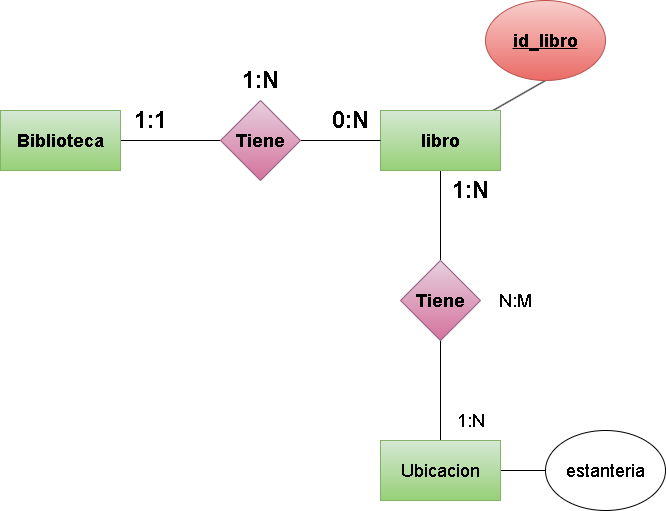
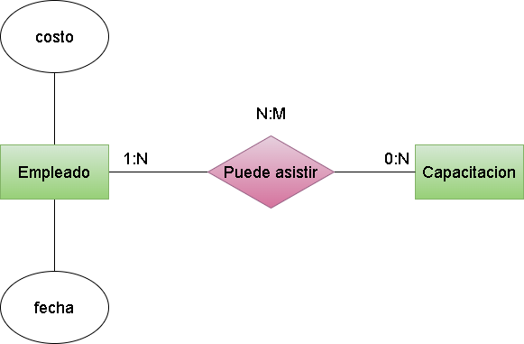
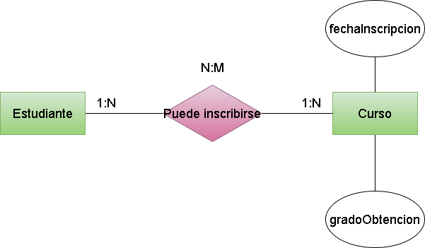
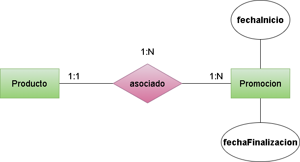
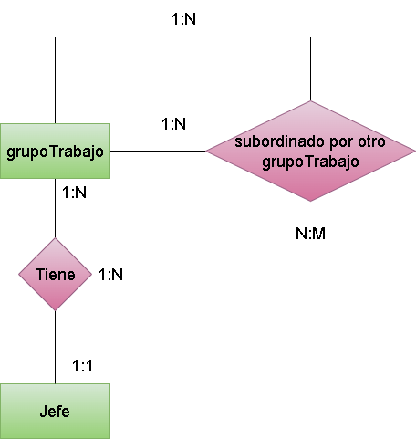
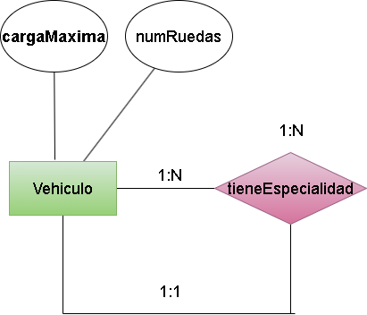
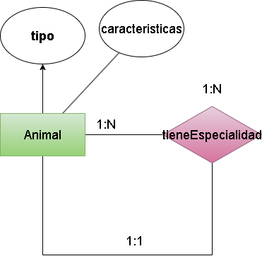
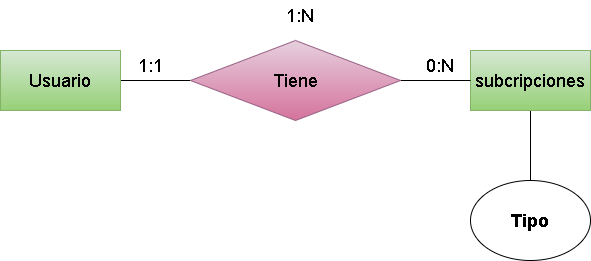
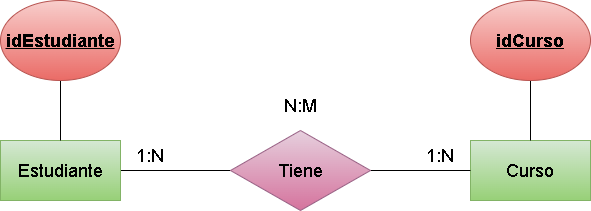
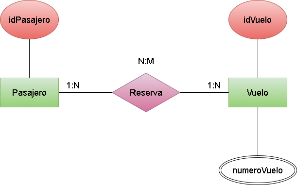

# **Unidad 2 Tarea 3** 

## *Ejercicio 1* 

### En un sistema de biblioteca, cada libro tiene un número único de identificación (ID). Se requiere almacenar información adicional sobre la ubicación de cada libro (como la estantería), y esta información solo se puede asociar con un libro en particular. Diseña las tablas y define la relación entre ellas.

## *Ejercicio 2*

### En una universidad, cada estudiante tiene asignado un único locker o casillero para su uso durante el semestre. El número de casillero solo puede estar asociado a un único estudiante. Diseña las tablas y su relación.

## *Ejercicio 3*

### En una empresa, cada trabajador tiene un único dispositivo de acceso (como una tarjeta de identificación) para acceder a las instalaciones. Crea las tablas correspondientes para gestionar la relación entre los empleados y sus dispositivos de acceso.

## *Ejercicio 4*

### En un sistema de gestión de proyectos, cada proyecto tiene múltiples tareas, pero cada tarea pertenece a un solo proyecto. Diseña las tablas que representen esta relación.

## *Ejercicio 5*

### En una tienda en línea, un cliente puede realizar múltiples pedidos, pero cada pedido corresponde a un solo cliente. Crea las tablas y define la relación correspondiente.

## *Ejercicio 6*

### En una universidad, los estudiantes pueden estar inscritos en varios cursos, y un curso puede tener varios estudiantes inscritos. Diseña las tablas para modelar esta relación.

## *Ejercicio 7*

### En una plataforma de cine en línea, los usuarios pueden agregar múltiples películas a su lista de favoritos, y cada película puede ser añadida por múltiples usuarios. Crea las tablas y la relación entre ellas.

## *Ejercicio 8*

### En una red social, los usuarios pueden seguir a otros usuarios y ser seguidos por ellos, es decir, cada usuario puede seguir a varios usuarios y ser seguido por varios. Diseña las tablas necesarias para representar esta relación.

## *Ejercicio 9*

### En una tienda en línea, un cliente puede realizar múltiples compras. Cada compra tiene información adicional como la fecha de compra y el monto total. Diseña las tablas para reflejar esta relación.

## *Ejercicio 10*

### En un sistema de gestión de empleados, un empleado puede asistir a múltiples capacitaciones. Cada capacitación tiene un costo y una fecha, además de estar vinculada al empleado. Crea las tablas y la relación con los atributos adicionales.

## *Ejercicio 11*

### En una plataforma de reservas de vuelos, un pasajero puede reservar múltiples boletos, y cada boleto tiene atributos como el número de asiento y la fecha de vuelo. Diseña las tablas necesarias.

## *Ejercicio 12*

### En una universidad, los estudiantes pueden estar inscritos en varios cursos, y un curso puede tener varios estudiantes. Además, para cada inscripción se debe almacenar la fecha de inscripción y el grado obtenido. Crea las tablas y la relación con los atributos adicionales.

## *Ejercicio 13*

### En una plataforma de música, los usuarios pueden crear varias listas de reproducción y agregar varias canciones a cada lista. Además, cada canción en una lista tiene un orden de reproducción. Diseña las tablas necesarias.

## *Ejercicio 14*

### En una tienda en línea, los productos pueden estar asociados a varias promociones, y cada promoción tiene una fecha de inicio y una fecha de finalización. Diseña las tablas y la relación con los atributos adicionales.

## *Ejercicio 15*

### En una empresa, cada empleado puede ser jefe de otros empleados. Diseña las tablas necesarias para modelar esta relación de jerarquía dentro de la misma entidad "Empleado".

## *Ejercicio 16*

### En una red social, los usuarios pueden tener amigos, y un usuario puede ser amigo de muchos otros usuarios. Diseña las tablas que reflejen esta relación recursiva.

## *Ejercicio 18*

### En una organización, un grupo de trabajo puede estar subordinado a otro grupo de trabajo. Cada grupo de trabajo tiene un jefe, que es otro grupo de trabajo. Crea las tablas y la relación recursiva.

## *Ejercicio 19*

### En una tienda de vehículos, se tiene una entidad general "Vehículo", que puede especializarse en "Coche", "Moto" y "Camión". Cada tipo tiene atributos específicos como "Número de ruedas" o "Carga máxima". Diseña las tablas para representar esta jerarquía.

## *Ejercicio 20*

### En un sistema de gestión de animales en un zoológico, se tiene una entidad general "Animal", que puede especializarse en "Mamífero", "Reptil" y "Ave". Cada tipo de animal tiene características específicas. Diseña las tablas que reflejen esta especialización.

## *Ejercicio 21*

### En una plataforma de medios, los usuarios pueden tener diferentes tipos de suscripciones: "Básica", "Estándar" y "Premium". Cada tipo de suscripción tiene atributos específicos. Crea las tablas correspondientes.

## *Ejercicio 22*

### En un sistema de gestión de estudiantes y cursos, cada estudiante puede estar inscrito en varios cursos, y un curso puede tener varios estudiantes. La combinación del ID del estudiante y el ID del curso forma una clave compuesta. Diseña las tablas y la relación.

## *Ejercicio 23*

### En una plataforma de reservas de vuelos, se realiza una reserva con una combinación de ID de pasajero y ID de vuelo. Crea las tablas correspondientes para representar la clave compuesta.

