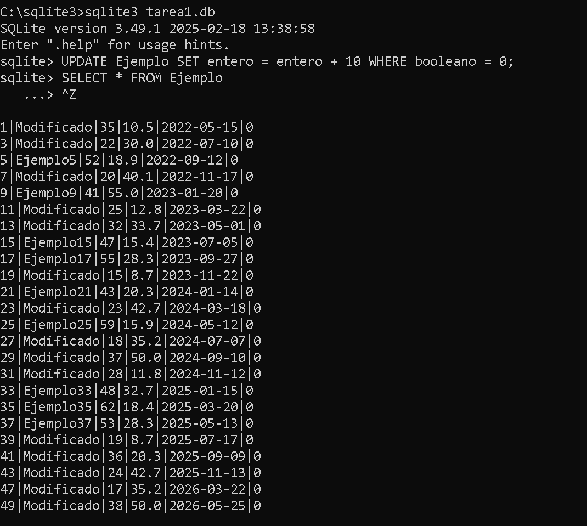

# **__Unidad 3 Tarea 1__** **(Primeros pasos en SQL)**

## OJBETIVO: Usar comandos para la base de datos 📃​

### **Paso 1:** Crear una tabla con un campo de cada tipo

#### **1.** Utilizando la terminal o línea de comandos, abre SQLite3 y crea una base de datos llamada tarea1.db.

#### **2.** Dentro de SQLite3, crea una tabla llamada Ejemplo con los siguientes campos:

##### id (tipo INTEGER, clave primaria), texto (tipo TEXT), entero (tipo INTEGER), fecha (tipo DATE), booleano (tipo BOOLEAN)

 

## Solucion

 

### **Paso 2:** Insertar 50 entradas

#### **1.** Realiza la inserción en la tabla Ejemplo de las 50 entradas.

 

## **Solucion**

 

### **Paso 3:** Realizar 5 consultas de datos

#### **1.** Obtén todas las entradas de la tabla Ejemplo.

## **Solucion**

 

####  **2.** Obtén las entradas con el campo entero mayor a 50.

## **Solucion**

 

### **Paso 4:** Realizar 3 eliminaciones y 3 modificaciones

#### **1.** Elimina las entradas donde el campo booleano es igual a True.

## **Solucion**

 

#### **2.** Modifica el campo texto de las entradas donde el campo entero es menor a 30 y establece el texto como "Modificado".

## **Solucion**

 

#### **3.** Elimina las entradas donde el campo entero es igual a 50.

## **Solucion**

 

#### **4.** Incrementa en 10 el valor del campo entero para las entradas donde el campo booleano es igual a False.

## **Solucion**

 

#### **5.** Elimina las entradas donde el campo decimal es menor a 50.

## **Solucion**

 

#### **6.** Actualiza el campo fecha de todas las entradas a la fecha actual.

## **Solucion**

