

# **__Unidad 3 Tarea 2__** **(SQL)**

## OJBETIVO: Usar comandos para la base de datos 📃​

### **Paso 1:** Crear una tabla con un campo de cada tipo

#### 1. Utilizando la terminal o línea de comandos, abre SQLite3 y crea una base de datos llamada tarea2.db.

#### 2. Dentro de SQLite3, crea las siguientes tablas:

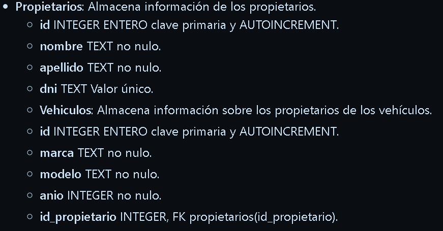

 

## **Solucion**

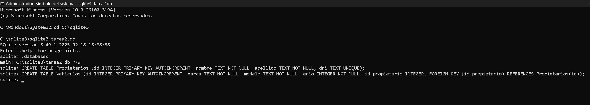

 

### **Paso 2:** Insertar 20 entradas

#### 1. Realiza la inserción en la tablas de modo que la información quede almacenada **(Propietario, Vehiculo).** 🤵🚗

## Solucion

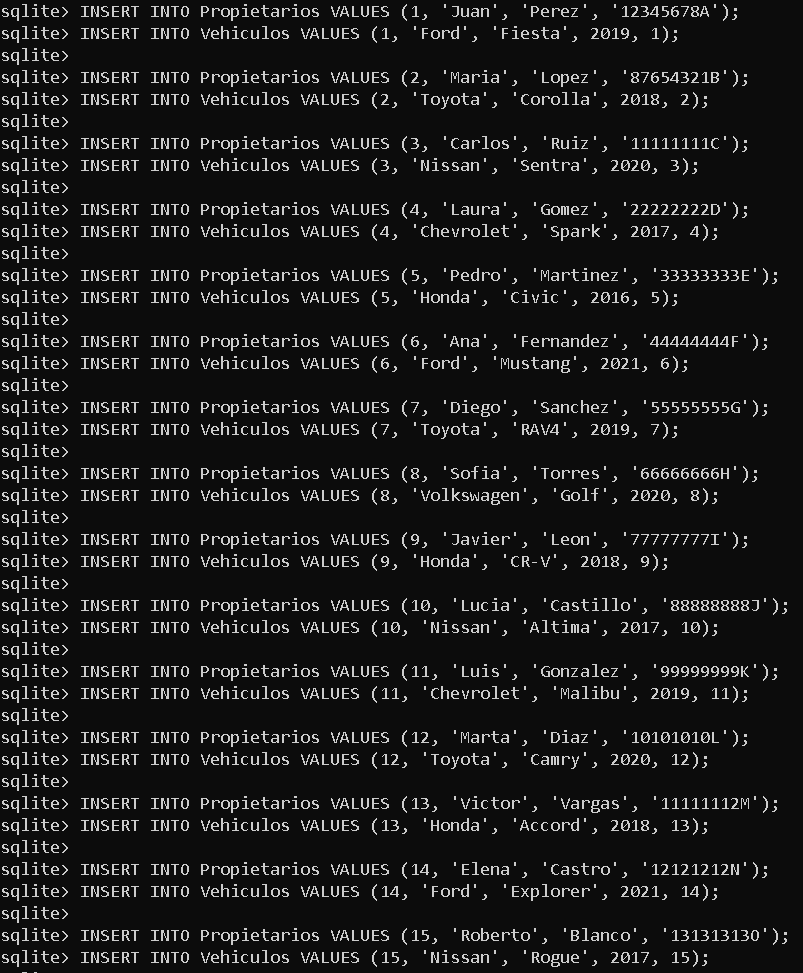

 

### **Paso 3:** Realizar las siguientes 10 consultas de datos

#### **1.** Seleccionar todos los propietarios

## **Solucion**

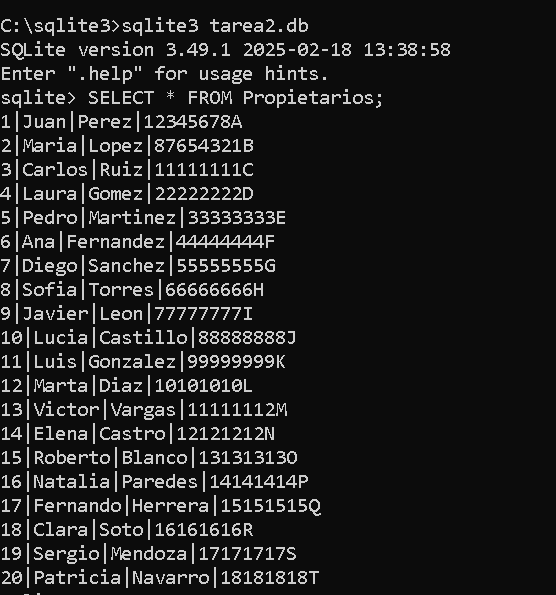

 

#### **2.** Listar todos los vehículos.

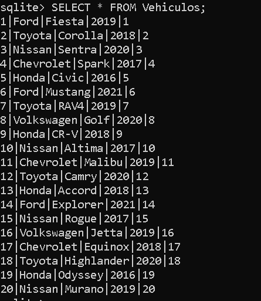

 

#### **3.** Seleccionar solo los nombres y apellidos de los propietarios.

## **Solucion**

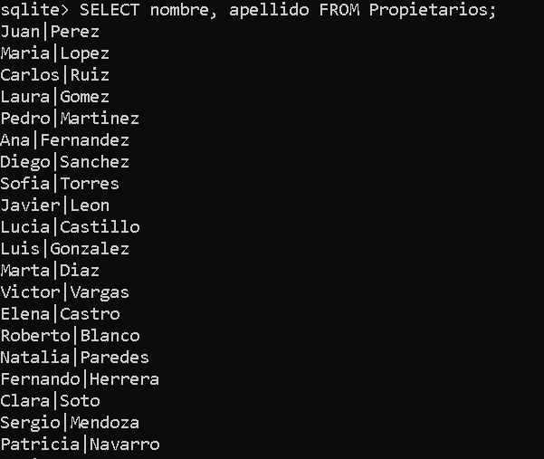

 

#### **4.** Listar todas las marcas y modelos de los vehículos.

## **Solucion**

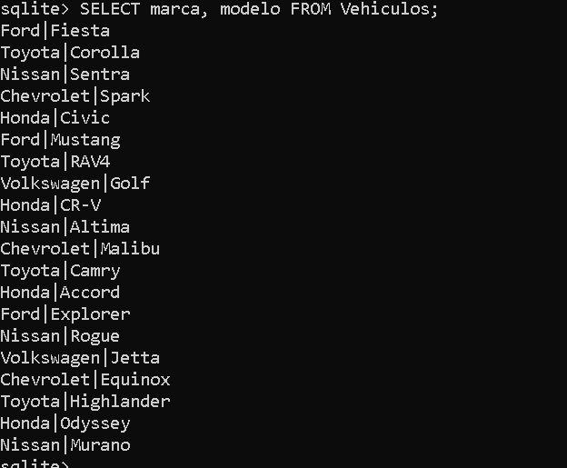

 

#### **5.** Seleccionar solo los propietarios con apellido "Perez".

## **Solucion**

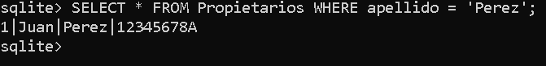

 

#### **6.** Listar todos los vehículos con año 2019.

## **Solucion**

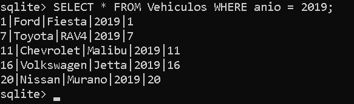

 

#### **7.** Seleccionar propietarios que tienen vehículos de la marca "Toyota".

## **Solucion**

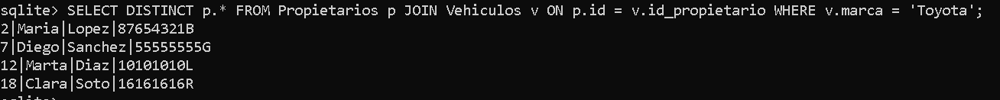

 

#### **8.** Listar vehículos con marca "Ford" y modelo "Fiesta".

## **Solucion**

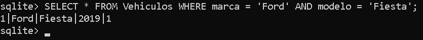

 

#### **9.** Seleccionar propietarios con DNI "12345678A".

## **Solucion**

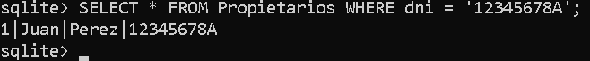

 

#### **10.** Listar vehículos que pertenecen al propietario con ID 5.

## **Solucion**

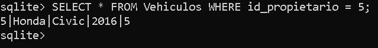

 

### **Paso 4:** Realiza los siguientes updates

#### **1.** Actualizar el nombre de un propietario con DNI "12345678A".

## **Solucion**

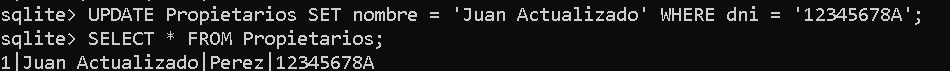

 

#### **2.** Modificar el año de un vehículo con ID 3 a 2022.

## **Solucion**

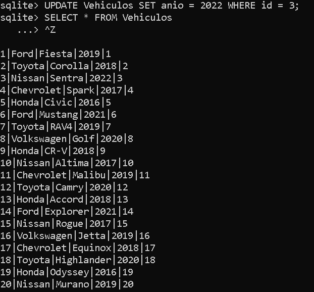

 

#### **3.** Cambiar el modelo de todos los vehículos Nissan a "Micra".

## **Solucion**

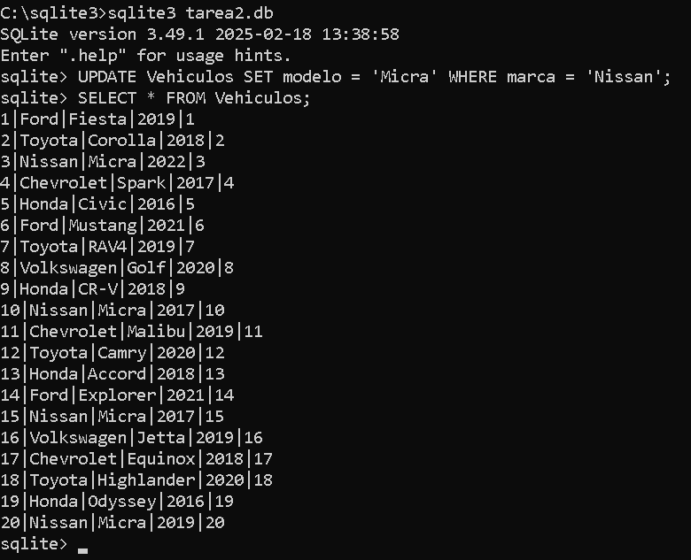

 

#### **4.** Actualizar el apellido de un propietario con ID 7 a "Gomez".

## **Solucion**

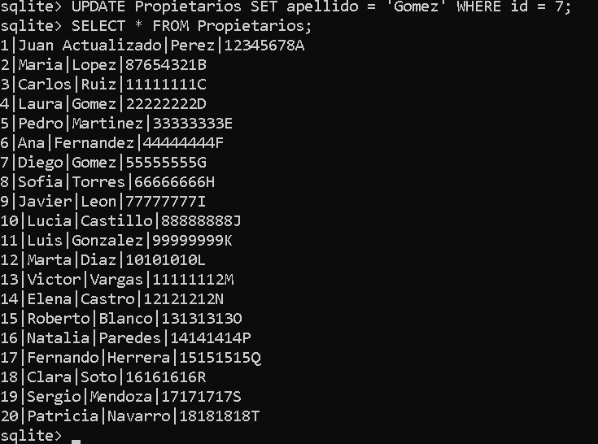

 

#### **5.** Modificar la marca de un vehículo con modelo "Fiesta" a "Renault".

## **Solucion**

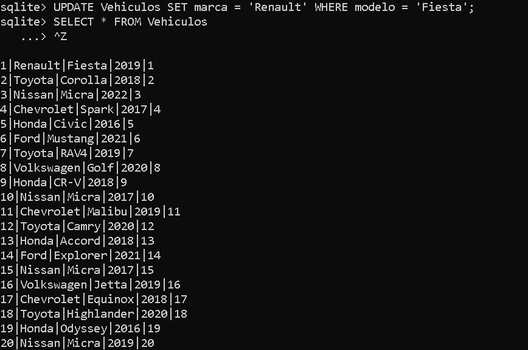

 

