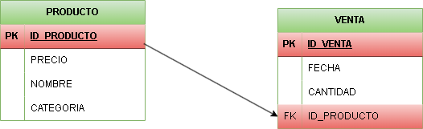
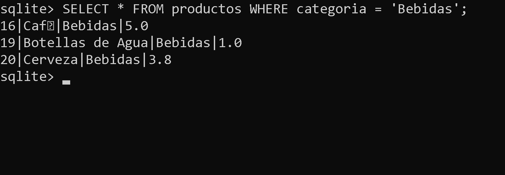
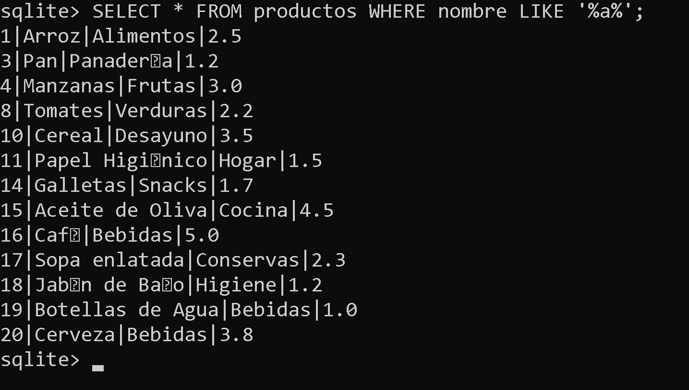
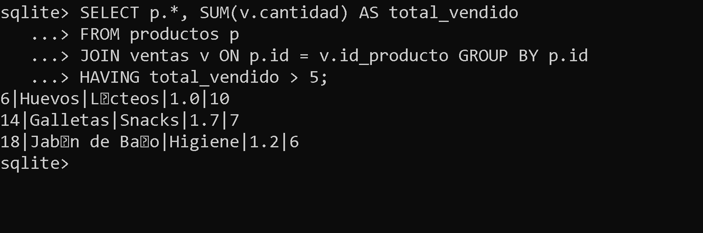
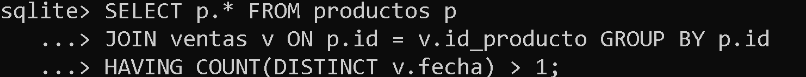
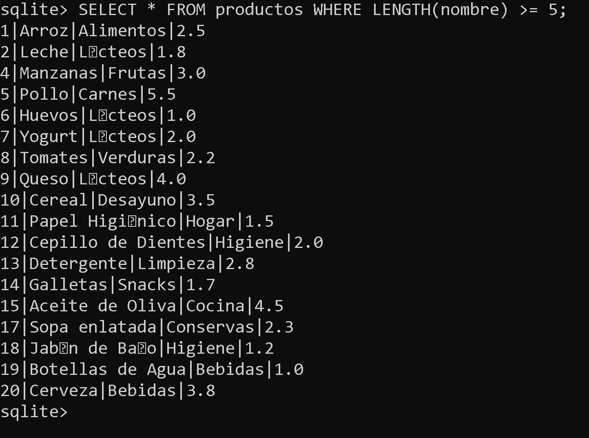

<div align="justify">

# **__Unidad 3 Tarea 4__** **(SQL)**


## OJBETIVO: Usar comandos para la base de datos 📃​


### **Paso 1:** Creación de la BBDD


#### **1.** Crea con el siguente contenido el fichero supermercado-dump.sql.

## **Solucion**


<br>

### **Paso 2:** Lectura del fichero sql.

#### **1.** Haciendo un .read del fichero sql, de nombre supermercado-db.sql, realiza la creación e inserción de información de la BBDD.

## **Solucion**


<br>


### **Paso 3:** Responde a las siguientes cuestiones

#### **1.** Realiza el diagrama ER de la BBDD supermercado.

## **Solucion**


<br>

#### **2.** Realiza el diagrama MR de la BBDD supermercado.

## **Solucion**




#### **3.** Indica si la BBDD esta normalizada hasta la 3ª forma normal, justificando la respuesta.

```SQL

CREATE TABLE productos (
    id INTEGER PRIMARY KEY,
    nombre TEXT,
    categoria TEXT,
    precio REAL
);

CREATE TABLE ventas (
    id INTEGER PRIMARY KEY,
    id_producto INTEGER,
    cantidad INTEGER,
    fecha DATE,
    FOREIGN KEY (id_producto) REFERENCES productos(id)
);

INSERT INTO productos (id, nombre, categoria, precio) VALUES 
    (1, 'Arroz', 'Alimentos', 2.5),
    (2, 'Leche', 'Lácteos', 1.8),
    (3, 'Pan', 'Panadería', 1.2),
    (4, 'Manzanas', 'Frutas', 3.0),
    (5, 'Pollo', 'Carnes', 5.5),
    (6, 'Huevos', 'Lácteos', 1.0),
    (7, 'Yogurt', 'Lácteos', 2.0),
    (8, 'Tomates', 'Verduras', 2.2),
    (9, 'Queso', 'Lácteos', 4.0),
    (10, 'Cereal', 'Desayuno', 3.5),
    (11, 'Papel Higiénico', 'Hogar', 1.5),
    (12, 'Cepillo de Dientes', 'Higiene', 2.0),
    (13, 'Detergente', 'Limpieza', 2.8),
    (14, 'Galletas', 'Snacks', 1.7),
    (15, 'Aceite de Oliva', 'Cocina', 4.5),
    (16, 'Café', 'Bebidas', 5.0),
    (17, 'Sopa enlatada', 'Conservas', 2.3),
    (18, 'Jabón de Baño', 'Higiene', 1.2),
    (19, 'Botellas de Agua', 'Bebidas', 1.0),
    (20, 'Cerveza', 'Bebidas', 3.8);

INSERT INTO ventas (id_producto, cantidad, fecha) VALUES 
    (1, 5, '2024-01-17'),
    (2, 3, '2024-01-17'),
    (4, 2, '2024-01-17'),
    (5, 1, '2024-01-17'),
    (6, 10, '2024-01-18'),
    (8, 4, '2024-01-18'),
    (10, 2, '2024-01-18'),
    (14, 7, '2024-01-19'),
    (16, 3, '2024-01-19'),
    (18, 6, '2024-01-20');

```

## __Solucion__

__Primera Forma Normal (1NF):__

Todas los valores son atómicos y no hay valores multivaluados.

__Segunda Forma Normal (2NF):__

Cada tabla tiene una clave primaria (id en ambas tablas) y los atributos dependen de la clave primaria.

__Tercera Forma Normal (3NF):__

No existen dependencias transitivas en ninguna de las 2 tablas y los atributos dependen exclusivamente de la clave primaria


### __Paso 4:__ Responde a las siguientes cuestiones

#### __1.__ Mostrar todos los productos de la categoría "Bebidas".

## __Solucion__



<br>

#### __2.__ Listar los productos ordenados por precio de forma descendente.

## __Solucion__


<br>

#### __3.__ Calcular el precio total de todos los productos en la tabla "productos".

## __Solucion__


<br>

#### __4.__ Encontrar los productos con un nombre que contenga la letra 'a'.

## __Solucion__



<br>

#### __5.__ Obtener la cantidad total de productos vendidos en todas las fechas.

## __Solucion__ 


#### __6.__ Encontrar el producto más caro en cada categoría.

## __Solucion__ 


<br>

#### __7.__ Listar los productos que no han sido vendidos.

## __Solucion__


<br>

#### __8.__ Calcular el precio promedio de los productos en la categoría "Snacks".

## __Solucion__ 


<br>

#### __9.__ Encontrar los productos que han sido vendidos más de 5 veces.

## __Solucion__



<br>

#### __10.__ Mostrar la fecha y la cantidad de ventas para cada producto.

## __Solucion__


<br>

#### __11.__ Encontrar los productos que tienen un precio menor o igual a 2.

## __Solucion__


<br>

#### __12.__ Calcular la cantidad total de ventas para cada fecha.

## __Solucion__


<br>

#### __13.__ Listar los productos cuyo nombre comienza con la letra 'P'.

## __Solucion__


<br>

#### __14.__ Obtener el producto más vendido en términos de cantidad.

## __Solucion__


<br>

#### __15.__ Mostrar los productos que fueron vendidos en la fecha '2024-01-18'.

## __Solucion__


<br>

#### __16.__ Calcular el total de ventas para cada producto.

## __Solucion__


<br>

#### __17.__ Encontrar los productos con un precio entre 3 y 4.

## __Solucion__


<br>

#### __18.__ Listar los productos y sus categorías ordenados alfabéticamente por categoría.

## __Solucion__


<br>

#### __19.__ Calcular el precio total de los productos vendidos en la fecha '2024-01-19'.

## __Solucion__


<br>

#### __20.__ Mostrar los productos que no pertenecen a la categoría "Higiene".

## __Solucion__


<br>

#### __21.__ Encontrar la cantidad total de productos en cada categoría.

## __Solucion__


<br>

#### __22.__ Listar los productos que tienen un precio igual a la media de precios.

## __Solucion__


<br>

#### __23.__ Calcular el precio total de los productos vendidos en cada fecha.

## __Solucion__


<br>

#### __24.__ Mostrar los productos con un nombre que termina con la letra 'o'.

## __Solucion__


<br>

#### __25.__ Encontrar los productos que han sido vendidos en más de una fecha.

## __Solucion__



<br>

#### __26.__ Listar los productos cuya categoría comienza con la letra 'L'.

## __Solucion__


<br>

#### __27.__ Calcular el total de ventas para cada producto en la fecha '2024-01-17'.

## __Solucion__


<br>

#### __28.__ Mostrar los productos cuyo nombre tiene al menos 5 caracteres.

## __Solucion__



<br>

#### __29.__ Encontrar los productos que tienen un precio superior al precio máximo en la tabla "productos".

## __Solucion__


</div>