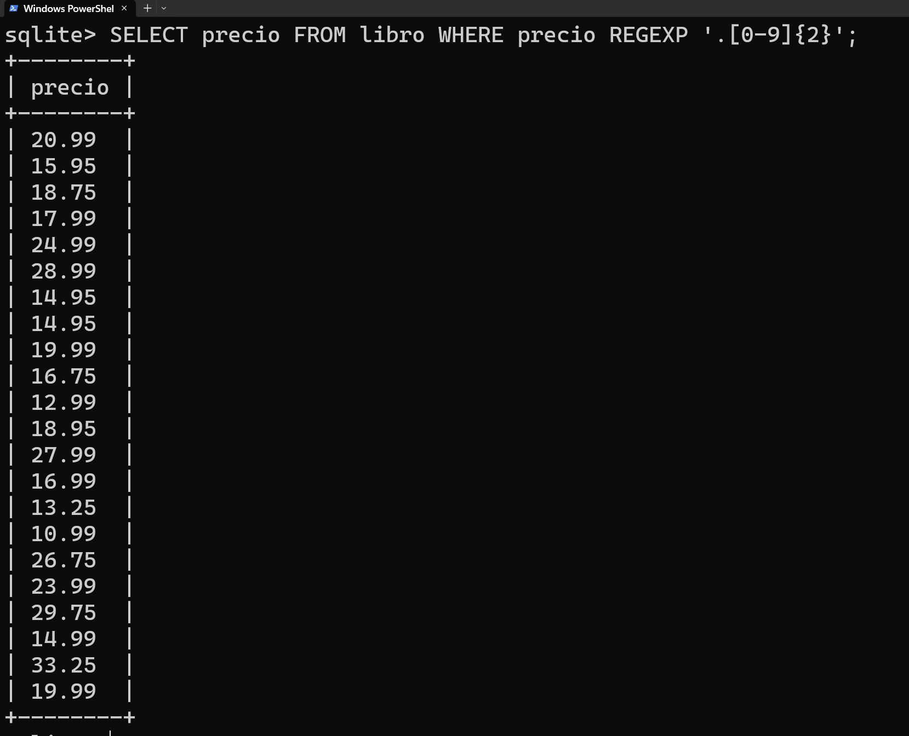
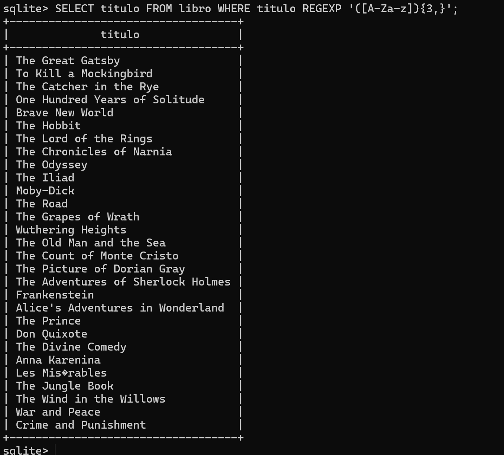
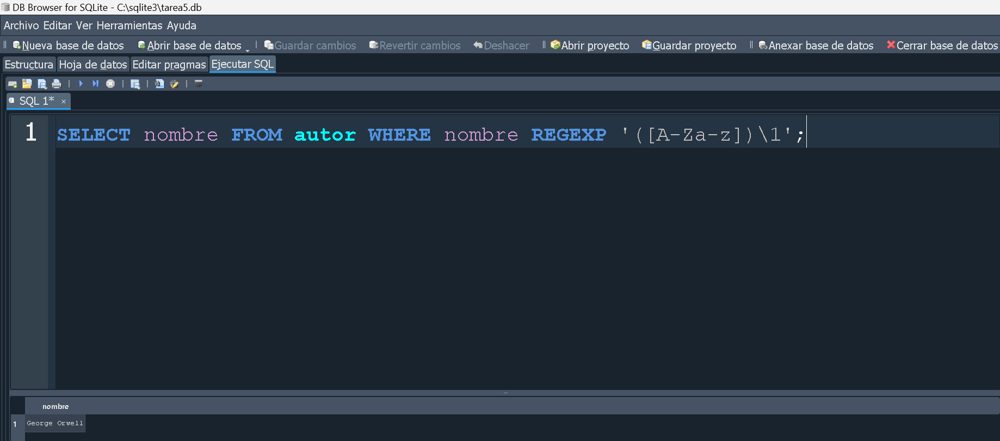

#  __Unidad 3 Tarea 5__ EXPRESIONES REGULARES 


### Operadores en expresiones regulares

| Operador  | Descripción                                      | Ejemplo                |
|-----------|--------------------------------------------------|------------------------|
| `.`       | Coincide con cualquier carácter excepto nueva línea | `a.b` coincide con "aab", "abb", "acb", etc. |
| `^`       | Coincide con el inicio de la cadena               | `^abc` coincide con "abc" al inicio de la cadena. |
| `$`       | Coincide con el final de la cadena                | `xyz$` coincide con "xyz" al final de la cadena. |
| `*`       | Coincide con cero o más repeticiones del elemento anterior | `a*b` coincide con "ab", "aab", "aaab", etc. |
| `+`       | Coincide con una o más repeticiones del elemento anterior | `a+b` coincide con "ab", "aab", "aaab", etc. |
| `?`       | Coincide con cero o una repetición del elemento anterior | `a?b` coincide con "ab" o "b". |
| `\`       | Escapa el significado especial de un carácter      | `\.` coincide con el carácter punto literal. |
| `[]`      | Coincide con cualquier carácter dentro de los corchetes | `[aeiou]` coincide con cualquier vocal. |
| `[^]`     | Coincide con cualquier carácter que no esté dentro de los corchetes | `[^0-9]` coincide con cualquier carácter que no sea un dígito. |
| `()`      | Agrupa elementos para aplicar operadores a una expresión completa | `(abc)+` coincide con "abc", "abcabc", etc. |
| `\d`      | Coincide con un dígito (equivalente a `[0-9]`)   | `\d{3}` coincide con tres dígitos. |
| `\w`      | Coincide con un carácter de palabra (letras, dígitos, guiones bajos) | `\w+` coincide con una o más palabras. |
| `\s`      | Coincide con un carácter de espacio en blanco     | `\s*` coincide con cero o más espacios en blanco. |
| `|`       | Operador lógico "o"                               | `a|b` coincide con "a" o "b". |


<br>

REGEXP = SQL  

regex = java

<details>
<summary><strong>Base de datos de libros</strong></summary>

```SQL
-- Elimino la tabla autor si exite
DROP TABLE if EXISTS autor;
CREATE TABLE IF NOT EXISTS autor (
    id INTEGER PRIMARY KEY,
    nombre TEXT
);
-- Elimino la tabla libro si existe
DROP table if EXISTS libro;
CREATE TABLE IF NOT EXISTS libro (
    codigo INTEGER PRIMARY KEY,
    titulo TEXT,
    autor_id INTEGER,
    editorial TEXT,
    precio REAL,
    FOREIGN KEY (autor_id) REFERENCES autor(id)
);

INSERT INTO autor (nombre) VALUES
    ('J.K. Rowling'),
    ('Stephen King'),
    ('George Orwell'),
    ('Jane Austen'),
    ('Agatha Christie');

INSERT INTO libro (titulo, autor_id, editorial, precio) VALUES
    ('The Great Gatsby', 6, 'Charles Scribner''s Sons', 20.99),
    ('To Kill a Mockingbird', 7, 'J.B. Lippincott & Co.', 15.95),
    ('The Catcher in the Rye', 8, 'Little, Brown and Company', 18.75),
    ('One Hundred Years of Solitude', 9, 'Harper & Row', 22.50),
    ('Brave New World', 3, 'Chatto & Windus', 17.99),
    ('The Hobbit', 10, 'George Allen & Unwin', 24.99),
    ('The Lord of the Rings', 10, 'George Allen & Unwin', 35.50),
    ('The Chronicles of Narnia', 11, 'Geoffrey Bles', 28.99),
    ('The Odyssey', 12, 'Homer', 14.95),
    ('The Iliad', 12, 'Homer', 14.95),
    ('Moby-Dick', 13, 'Harper & Brothers', 19.99),
    ('The Road', 14, 'Alfred A. Knopf', 16.75),
    ('The Grapes of Wrath', 15, 'The Viking Press', 21.50),
    ('Wuthering Heights', 16, 'Emily Brontë', 12.99),
    ('The Old Man and the Sea', 17, 'Charles Scribner''s Sons', 18.95),
    ('The Count of Monte Cristo', 18, 'Pétion', 27.99),
    ('The Picture of Dorian Gray', 19, 'Ward, Lock, and Company', 14.50),
    ('The Adventures of Sherlock Holmes', 20, 'George Newnes', 16.99),
    ('Frankenstein', 21, 'Lackington, Hughes, Harding, Mavor, & Jones', 13.25),
    ('Alice''s Adventures in Wonderland', 22, 'Macmillan', 11.50),
    ('The Prince', 23, 'Niccolò Machiavelli', 10.99),
    ('Don Quixote', 24, 'Francisco de Robles', 26.75),
    ('The Divine Comedy', 25, 'Dante Alighieri', 20.50),
    ('Anna Karenina', 26, 'The Russian Messenger', 23.99),
    ('Les Misérables', 27, 'A. Lacroix, Verboeckhoven & Cie.', 29.75),
    ('The Jungle Book', 28, 'Macmillan Publishers', 14.99),
    ('The Wind in the Willows', 29, 'Methuen & Co.', 17.50),
    ('War and Peace', 26, 'The Russian Messenger', 33.25),
    ('Crime and Punishment', 30, 'The Russian Messenger', 19.99);
```
</details>


### __1.__ Selección de libros cuyo título comienza con "H".


 

<br>

### __2.__ Libros escritos por autores cuyos nombres terminan con "ing".


<br>

### __3.__ Libros con títulos que contienen la palabra "and" en cualquier posición.


<br>

### __4.__ Libros cuyo título comienza con una vocal.


<br>

### __5.__ Libros cuyo autor tiene al menos una vocal repetida.


<br>

### __6.__ Libros con precios que tienen dos dígitos decimales exactos.


<br>

### __7.__ Libros cuyos títulos tienen al menos tres palabras.


<br>

### __8.__ Obtener todos los autores cuyo nombre empieza con la letra "A":


<br>

### __9.__ Seleccionar los libros cuyo título contiene la palabra "SQL":


<br>

### __10.__ Obtener todos los autores cuyo nombre termina con "ez":


<br>

### __11.__ Obtener todos los autores cuyo nombre tiene al menos 5 caracteres:


<br>

### __12.__ Seleccionar los libros cuya editorial es diferente de "EditorialX":


<br>

### __13.__ Obtener todos los autores cuyo nombre contiene al menos una vocal:


<br>

### __14.__ Seleccionar los libros cuyo título comienza con una letra mayúscula:


<br>

### __15.__ Obtener todos los autores cuyo nombre no contiene la letra "r":


<br>

### __16.__ Seleccionar los libros cuya editorial empieza con la letra "P":


<br>

### __17.__ Obtener todos los autores cuyo nombre tiene exactamente 6 caracteres:


<br>

### __18.__ Seleccionar los libros cuyo título contiene al menos un número:


<br>

### __19.__ Obtener todos los autores cuyo nombre inicia con una vocal:


<br>

### __20.__ Obtener todos los autores cuyo nombre no contiene espacios en blanco:


<br>

### __21.__ Seleccionar los libros cuyo título termina con una vocal:


<br>

### __22.__ Obtener todos los autores cuyo nombre contiene la secuencia "er":


<br>

### __23.__ Seleccionar los libros cuyo título empieza con la palabra "The":


<br>

### __24.__ Obtener todos los autores cuyo nombre tiene al menos una letra mayúscula:


<br>

### __25.__ Seleccionar los libros cuyo precio es un número decimal con exactamente dos decimales:




<br>

### __26.__ Obtener todos los autores cuyo nombre no contiene números:


<br>

### __27.__ Seleccionar los libros cuyo título contiene al menos tres vocales:




<br>

### __28.__ Obtener todos los autores cuyo nombre inicia con una consonante:


<br>

### __29.__ Seleccionar los libros cuyo título no contiene la palabra "Science":


<br>

### __30.__ Obtener todos los autores cuyo nombre tiene al menos una letra repetida consecutivamente:




<br>

### __31.__ Obtener todos los autores cuyo nombre empieza con "M" o termina con "n":


<br>

### __32.__ Obtener todos los autores cuyo nombre no contiene caracteres especiales:


