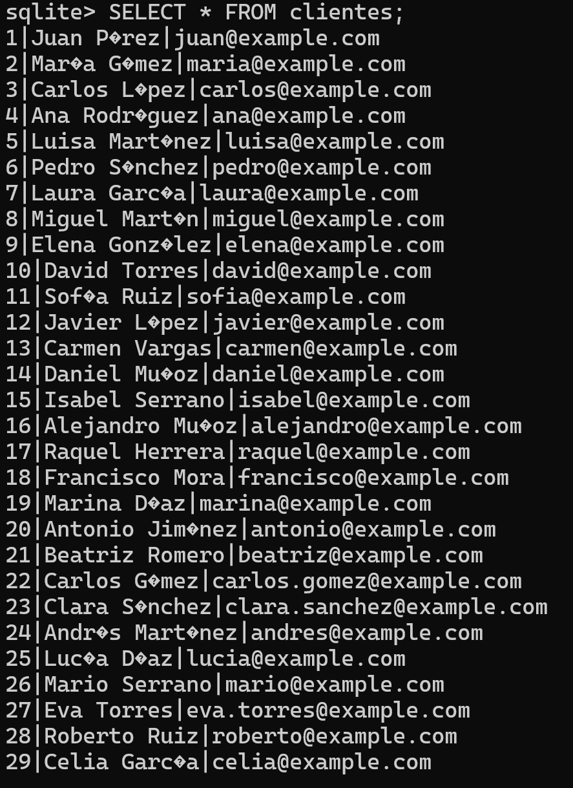
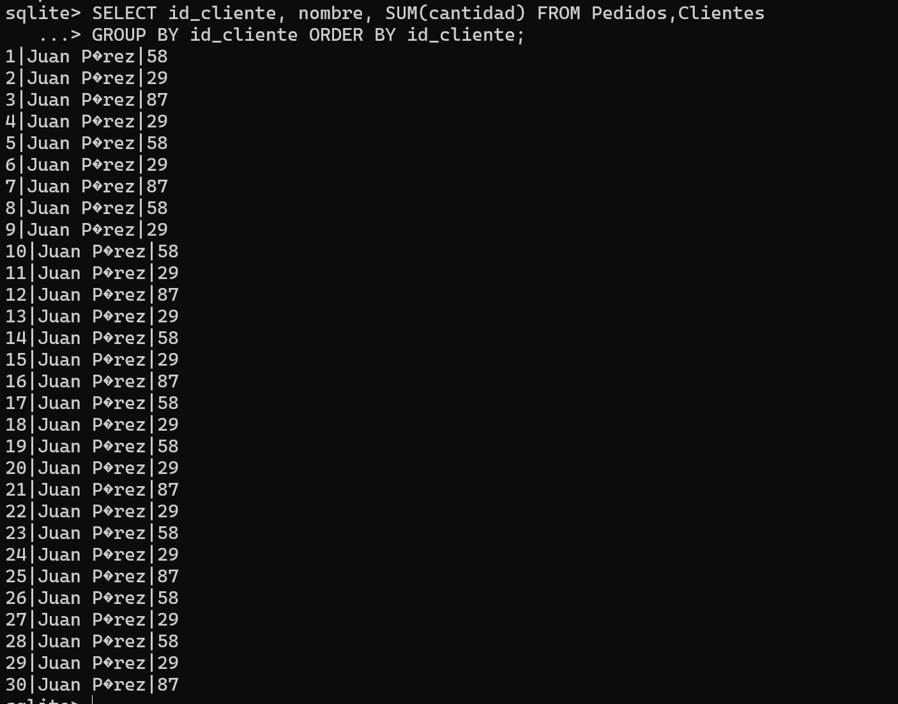
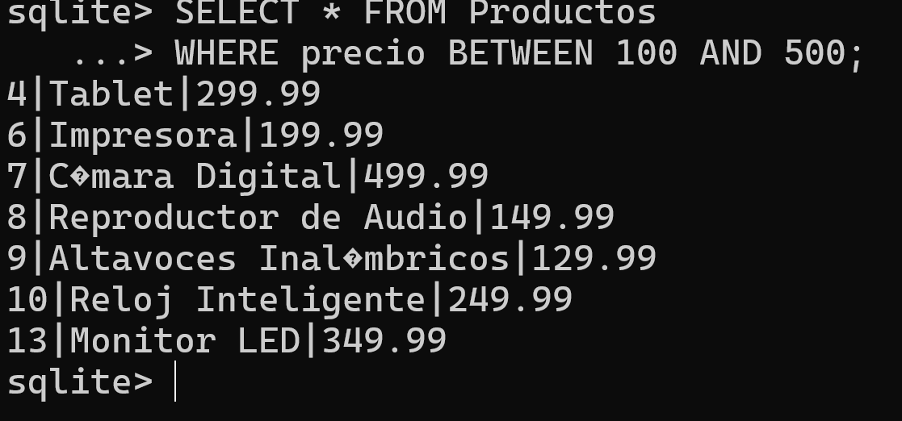

<div align="justify">


# __Unidad 3 Tarea 6__ (Expresiones Regulares y Funciones)


### 📜📜 FUNCIONES Y EXPRESIONES REGULARES (SQL) 📜📜

## EXPRESIONES REGULARES (SQL)

| Operador  | Descripción                                      | Ejemplo                |
|-----------|--------------------------------------------------|------------------------|
| `.`       | Coincide con cualquier carácter excepto nueva línea | `a.b` coincide con "aab", "abb", "acb", etc. |
| `^`       | Coincide con el inicio de la cadena               | `^abc` coincide con "abc" al inicio de la cadena. |
| `$`       | Coincide con el final de la cadena                | `xyz$` coincide con "xyz" al final de la cadena. |
| `*`       | Coincide con cero o más repeticiones del elemento anterior | `a*b` coincide con "ab", "aab", "aaab", etc. |
| `+`       | Coincide con una o más repeticiones del elemento anterior | `a+b` coincide con "ab", "aab", "aaab", etc. |
| `?`       | Coincide con cero o una repetición del elemento anterior | `a?b` coincide con "ab" o "b". |
| `\`       | Escapa el significado especial de un carácter      | `\.` coincide con el carácter punto literal. |
| `[]`      | Coincide con cualquier carácter dentro de los corchetes | `[aeiou]` coincide con cualquier vocal. |
| `[^]`     | Coincide con cualquier carácter que no esté dentro de los corchetes | `[^0-9]` coincide con cualquier carácter que no sea un dígito. |
| `()`      | Agrupa elementos para aplicar operadores a una expresión completa | `(abc)+` coincide con "abc", "abcabc", etc. |
| `\d`      | Coincide con un dígito (equivalente a `[0-9]`)   | `\d{3}` coincide con tres dígitos. |
| `\w`      | Coincide con un carácter de palabra (letras, dígitos, guiones bajos) | `\w+` coincide con una o más palabras. |
| `\s`      | Coincide con un carácter de espacio en blanco     | `\s*` coincide con cero o más espacios en blanco. |
| `|`       | Operador lógico "o"                               | `a|b` coincide con "a" o "b". |

## FUNCIONES (SQL)

| Categoría                   | Función                           | Descripción                                               |
|-----------------------------|-----------------------------------|-----------------------------------------------------------|
| **Funciones de Texto**      | `LENGTH(str)`                     | Devuelve la longitud de la cadena.                         |
|                             | `SUBSTR(str, start, length)`       | Devuelve una subcadena de la cadena dada.                 |
|                             | `UPPER(str)`, `LOWER(str)`         | Convierte la cadena a mayúsculas o minúsculas.            |
| **Funciones Numéricas**     | `ABS(x)`                          | Devuelve el valor absoluto de x.                           |
|                             | `ROUND(x)`, `CEIL(x)`, `FLOOR(x)` | Redondeo de números.                                      |
|                             | `MAX(x, y, ...)`, `MIN(x, y, ...)` | Devuelve el valor máximo o mínimo entre los argumentos.   |
| **Funciones de Fecha y Hora**| `CURRENT_DATE`, `CURRENT_TIME`, `CURRENT_TIMESTAMP` | Devuelven la fecha, la hora o la marca de tiempo actuales. |
|                             | `DATE(str)`, `TIME(str)`, `DATETIME(str)` | Extraen partes de una fecha o marca de tiempo.             |
| **Funciones de Agregación**  | `SUM(column)`, `AVG(column)`      | Realizan operaciones de suma y promedio en una columna.    |
|                             | `COUNT(column)`, `MAX(column)`, `MIN(column)` | Realizan operaciones de conteo, máximo y mínimo en una columna. |
| **Funciones de Conversión**  | `CAST(expr AS type)`              | Convierte una expresión a un tipo de datos específico.    |
| **Funciones de Manipulación de Cadenas** | `CONCAT(str1, str2, ...)`  | Concatena cadenas.                                        |
| **Funciones de Control de Flujo** | `CASE WHEN condition THEN result END` | Realiza evaluaciones condicionales.                       |


<details>

<summary><b>Base de datos<b/></summary>

```SQL
-- Crear la tabla de Clientes
CREATE TABLE IF NOT EXISTS Clientes (
    id INTEGER PRIMARY KEY,
    nombre TEXT NOT NULL,
    email TEXT UNIQUE
);

-- Crear la tabla de Productos
CREATE TABLE IF NOT EXISTS Productos (
    id INTEGER PRIMARY KEY,
    nombre TEXT NOT NULL,
    precio REAL
);

-- Crear la tabla de Pedidos
CREATE TABLE IF NOT EXISTS Pedidos (
    id_pedido INTEGER PRIMARY KEY,
    id_cliente INTEGER,
    id_producto INTEGER,
    cantidad INTEGER,
    fecha_pedido DATE,
    FOREIGN KEY (id_cliente) REFERENCES Clientes(id),
    FOREIGN KEY (id_producto) REFERENCES Productos(id)
);

INSERT INTO Clientes (nombre, email) VALUES
    ('Juan Pérez', 'juan@example.com'),
    ('María Gómez', 'maria@example.com'),
    ('Carlos López', 'carlos@example.com'),
    ('Ana Rodríguez', 'ana@example.com'),
    ('Luisa Martínez', 'luisa@example.com'),
    ('Pedro Sánchez', 'pedro@example.com'),
    ('Laura García', 'laura@example.com'),
    ('Miguel Martín', 'miguel@example.com'),
    ('Elena González', 'elena@example.com'),
    ('David Torres', 'david@example.com'),
    ('Sofía Ruiz', 'sofia@example.com'),
    ('Javier López', 'javier@example.com'),
    ('Carmen Vargas', 'carmen@example.com'),
    ('Daniel Muñoz', 'daniel@example.com'),
    ('Isabel Serrano', 'isabel@example.com'),
    ('Alejandro Muñoz', 'alejandro@example.com'),
    ('Raquel Herrera', 'raquel@example.com'),
    ('Francisco Mora', 'francisco@example.com'),
    ('Marina Díaz', 'marina@example.com'),
    ('Antonio Jiménez', 'antonio@example.com'),
    ('Beatriz Romero', 'beatriz@example.com'),
    ('Carlos Gómez', 'carlos.gomez@example.com'),
    ('Clara Sánchez', 'clara.sanchez@example.com'),
    ('Andrés Martínez', 'andres@example.com'),
    ('Lucía Díaz', 'lucia@example.com'),
    ('Mario Serrano', 'mario@example.com'),
    ('Eva Torres', 'eva.torres@example.com'),
    ('Roberto Ruiz', 'roberto@example.com'),
    ('Celia García', 'celia@example.com');

INSERT INTO Productos (nombre, precio) VALUES
    ('Laptop', 1200.00),
    ('Smartphone', 699.99),
    ('TV LED', 799.50),
    ('Tablet', 299.99),
    ('Auriculares Bluetooth', 79.99),
    ('Impresora', 199.99),
    ('Cámara Digital', 499.99),
    ('Reproductor de Audio', 149.99),
    ('Altavoces Inalámbricos', 129.99),
    ('Reloj Inteligente', 249.99),
    ('Teclado Inalámbrico', 59.99),
    ('Ratón Óptico', 29.99),
    ('Monitor LED', 349.99),
    ('Mochila para Portátil', 49.99),
    ('Disco Duro Externo', 89.99),
    ('Router Wi-Fi', 69.99),
    ('Lámpara LED', 39.99),
    ('Batería Externa', 19.99),
    ('Estuche para Auriculares', 14.99),
    ('Tarjeta de Memoria', 24.99),
    ('Cargador Inalámbrico', 34.99),
    ('Kit de Limpieza para Computadoras', 9.99),
    ('Funda para Tablet', 19.99),
    ('Soporte para Teléfono', 14.99),
    ('Hub USB', 29.99),
    ('Webcam HD', 59.99),
    ('Funda para Laptop', 29.99),
    ('Adaptador HDMI', 12.99);
INSERT INTO Pedidos (id_cliente, id_producto, cantidad, fecha_pedido) VALUES
    (1, 1, 2, '2024-02-01'),
    (2, 2, 1, '2024-02-02'),
    (3, 3, 3, '2024-02-03'),
    (4, 4, 1, '2024-02-04'),
    (5, 5, 2, '2024-02-05'),
    (6, 6, 1, '2024-02-06'),
    (7, 7, 3, '2024-02-07'),
    (8, 8, 2, '2024-02-08'),
    (9, 9, 1, '2024-02-09'),
    (10, 10, 2, '2024-02-10'),
    (11, 11, 1, '2024-02-11'),
    (12, 12, 3, '2024-02-12'),
    (13, 13, 1, '2024-02-13'),
    (14, 14, 2, '2024-02-14'),
    (15, 15, 1, '2024-02-15'),
    (16, 16, 3, '2024-02-16'),
    (17, 17, 2, '2024-02-17'),
    (18, 18, 1, '2024-02-18'),
    (19, 19, 2, '2024-02-19'),
    (20, 20, 1, '2024-02-20'),
    (21, 21, 3, '2024-02-21'),
    (22, 22, 1, '2024-02-22'),
    (23, 23, 2, '2024-02-23'),
    (24, 24, 1, '2024-02-24'),
    (25, 25, 3, '2024-02-25'),
    (26, 26, 2, '2024-02-26'),
    (27, 27, 1, '2024-02-27'),
    (28, 28, 2, '2024-02-28'),
    (29, 29, 1, '2024-02-29'),
    (30, 30, 3, '2024-03-01');
``` 
</details>

### __1.__ Obtener todos los clientes.




<br>

### __2.__ Obtener la cantidad total de productos en todos los pedidos


<br>

### __3.__ Obtener el precio promedio de los productos.


<br>

### __4.__ Obtener los clientes que tienen un email válido (contiene '@')


<br>

### __5.__ Obtener el producto más caro.


<br>

### __6.__ Obtener los pedidos realizados en febrero de 2024.


<br>

### __7.__ Obtener la cantidad total de productos en todos los pedidos por producto.


<br>

### __8.__ Obtener los clientes que han realizado más de un pedido.


<br>

### __9.__ Obtener los productos que tienen un precio registrado.


<br>

### __10.__ Obtener la fecha del primer pedido realizado:


<br>

### __11.__ Obtener los productos cuyos nombres comienzan con 'A' o 'B':


<br>

### __12.__ Obtener la cantidad total de productos en todos los pedidos por cliente ordenado por cliente.




<br>

### __13.__ Obtener los clientes que han realizado más de un pedido en febrero de 2024.




<br>

### __14.__ Obtener los productos con precio entre 100 y 500.


<br>

### __15.__ Obtener la cantidad total de productos en todos los pedidos por cliente ordenado por cantidad descendente.


<br>

### __16.__ Obtener los clientes que tienen una 'a' en cualquier posición de su nombre.


<br>

### __17.__ Obtener el precio máximo de los productos.


<br>

### __18.__ Obtener los pedidos realizados por el cliente con ID 1 en febrero de 2024.


<br>

### __19.__ Obtener la cantidad total de productos en todos los pedidos por producto ordenado por total de productos descendente.


<br>

### __20.__ Obtener los productos que no tienen un precio registrado.


<br>

### __21.__ Obtener la fecha del último pedido realizado.


<br>

### __22.__ Obtener los clientes cuyo nombre tiene al menos 5 caracteres.


<br>

### __23.__ Obtener los productos que tienen la letra 'o' en cualquier posición del nombre.


<br>

### __24.__ Obtener la cantidad total de productos en todos los pedidos por cliente ordenado por cliente.


<br>

### __25.__ Obtener los clientes cuyos nombres no contienen la letra 'i':


<br>

### __26.__ Obtener los pedidos realizados por el cliente con ID 2 en febrero de 2024.


<br>

### __27.__ Obtener el precio mínimo de los productos.


<br>

### __28.__ Obtener los clientes que han realizado al menos un pedido en febrero de 2024.


<br>

### __29.__ Obtener la fecha del último pedido realizado por el cliente con ID 3.


<br>

### __30.__ Obtener los productos que tienen una 'a' al final del nombre.


<br>

### __31.__ Obtener los clientes cuyos nombres tienen al menos 4 vocales (mayúsculas|minúsculas).


<br>

### __32.__ Obtener los productos cuyo precio tenga al menos 4 números sin contrar los decimales.


### __33.__ Obtener los clientes cuyos nombres tienen al menos una 'a' seguida de una 'e'.


<br>

### __34.__ Obtener los productos cuyos nombres terminan con una consonante.


### __35.__ Obtener los productos cuyos nombres empiezan con una vocal.


<br>

</div>