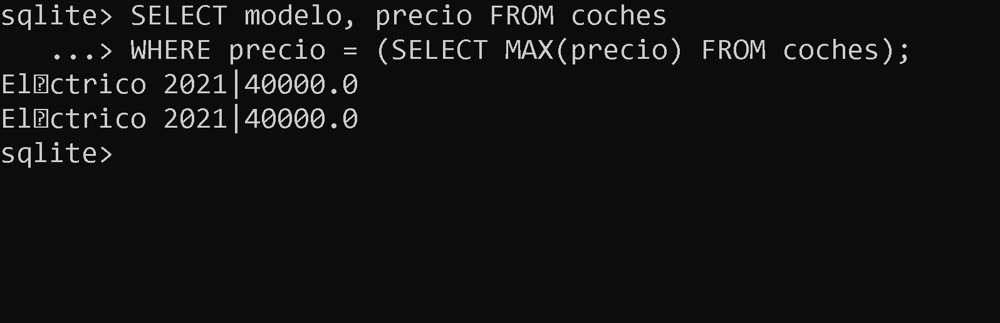

<div align="justify">

#  __Unidad 3 Tarea 7__ (Funciones y Subconsultas)

## 📜📜 SUBCONSULTAS CON FUNCIONES 📜📜

| Categoría                   | Función                           | Descripción                                               |
|-----------------------------|-----------------------------------|-----------------------------------------------------------|
| **Funciones de Texto**      | `LENGTH(str)`                     | Devuelve la longitud de la cadena.                         |
|                             | `SUBSTR(str, start, length)`       | Devuelve una subcadena de la cadena dada.                 |
|                             | `UPPER(str)`, `LOWER(str)`         | Convierte la cadena a mayúsculas o minúsculas.            |
| **Funciones Numéricas**     | `ABS(x)`                          | Devuelve el valor absoluto de x.                           |
|                             | `ROUND(x)`, `CEIL(x)`, `FLOOR(x)` | Redondeo de números.                                      |
|                             | `MAX(x, y, ...)`, `MIN(x, y, ...)` | Devuelve el valor máximo o mínimo entre los argumentos.   |
| **Funciones de Fecha y Hora**| `CURRENT_DATE`, `CURRENT_TIME`, `CURRENT_TIMESTAMP` | Devuelven la fecha, la hora o la marca de tiempo actuales. |
|                             | `DATE(str)`, `TIME(str)`, `DATETIME(str)` | Extraen partes de una fecha o marca de tiempo.             |
| **Funciones de Agregación**  | `SUM(column)`, `AVG(column)`      | Realizan operaciones de suma y promedio en una columna.    |
|                             | `COUNT(column)`, `MAX(column)`, `MIN(column)` | Realizan operaciones de conteo, máximo y mínimo en una columna. |
| **Funciones de Conversión**  | `CAST(expr AS type)`              | Convierte una expresión a un tipo de datos específico.    |
| **Funciones de Manipulación de Cadenas** | `CONCAT(str1, str2, ...)`  | Concatena cadenas.                                        |
| **Funciones de Control de Flujo** | `CASE WHEN condition THEN result END` | Realiza evaluaciones condicionales.                       |


<br>

<details>

<summary><b>Base de datos<b/></summary>

```SQL
-- Crear la base de datos
CREATE DATABASE IF NOT EXISTS concesionario;

-- Usar la base de datos
USE concesionario;

CREATE TABLE IF NOT EXISTS clientes (
    id_cliente INTEGER PRIMARY KEY,
    nombre TEXT,
    edad INTEGER,
    direccion TEXT
);


CREATE TABLE IF NOT EXISTS coches (
    id_coche INTEGER PRIMARY KEY,
    modelo TEXT,
    marca TEXT,
    año INTEGER,
    precio REAL
);


CREATE TABLE IF NOT EXISTS ventas (
    id_venta INTEGER PRIMARY KEY,
    id_cliente INTEGER,
    id_coche INTEGER,
    fecha_venta DATE,
    FOREIGN KEY (id_cliente) REFERENCES clientes(id_cliente),
    FOREIGN KEY (id_coche) REFERENCES coches(id_coche)
);


INSERT INTO clientes (nombre, edad, direccion) VALUES
    ('Juan Pérez', 30, 'Calle A #123'),
    ('María Gómez', 25, 'Avenida B #456'),
    ('Carlos López', 35, 'Calle C #789'),
    ('Ana Martínez', 28, 'Avenida D #101'),
    ('Pedro Rodríguez', 40, 'Calle E #234'),
    ('Laura Sánchez', 32, 'Avenida F #567'),
    ('Miguel González', 27, 'Calle G #890'),
    ('Isabel Díaz', 38, 'Avenida H #111'),
    ('Francisco Ruiz', 33, 'Calle I #222'),
    ('Elena Torres', 29, 'Avenida J #333');


INSERT INTO coches (modelo, marca, año, precio) VALUES
    ('Sedán 2022', 'Toyota', 2022, 25000.00),
    ('Hatchback 2021', 'Honda', 2021, 22000.00),
    ('SUV 2023', 'Ford', 2023, 30000.00),
    ('Coupé 2022', 'Chevrolet', 2022, 28000.00),
    ('Camioneta 2023', 'Nissan', 2023, 32000.00),
    ('Compacto 2021', 'Volkswagen', 2021, 20000.00),
    ('Híbrido 2022', 'Hyundai', 2022, 27000.00),
    ('Deportivo 2023', 'Mazda', 2023, 35000.00),
    ('Pickup 2022', 'Ram', 2022, 31000.00),
    ('Eléctrico 2021', 'Tesla', 2021, 40000.00);

INSERT INTO ventas (id_cliente, id_coche, fecha_venta) VALUES
    (1, 1, '2023-01-15'),
    (2, 2, '2023-02-20'),
    (3, 3, '2023-03-25'),
    (4, 4, '2023-04-10'),
    (5, 5, '2023-05-05'),
    (6, 6, '2023-06-15'),
    (7, 7, '2023-07-20'),
    (8, 8, '2023-08-25'),
    (10, 10, '2023-10-05');
``` 
</details>

<br>

## __CONSULTAS__


### __1.__ Listar los coches vendidos con sus modelos y precios, junto con los nombres de los clientes que los compraron.


 
<br>

### __2.__ Encontrar los clientes que han comprado coches con precios superiores al promedio de todos los coches vendidos.


<br>

### __3.__ Mostrar los modelos de coches y sus precios que no han sido vendidos aún:


<br>

### __4.__ Calcular el total gastado por todos los clientes en coches:


<br>

### __5.__ Listar los coches vendidos junto con la fecha de venta y el nombre del cliente, ordenados por fecha de venta de forma descendente:


<br>

### __6.__ Encontrar el modelo de coche más caro.





<br>

### __7.__ Mostrar los clientes que han comprado al menos un coche y la cantidad de coches comprados


<br>

### __8.__ Encontrar los clientes que han comprado coches de la marca 'Toyota'


<br>

### __9.__ Calcular el promedio de edad de los clientes que han comprado coches de más de 25,000


<br>

### __10.__ Mostrar los modelos de coches y sus precios que fueron comprados por clientes mayores de 30 años


<br>

### __11.__ Encontrar los coches vendidos en el año 2022 junto con la cantidad total de ventas en ese año


<br>

### __12.__ Listar los coches cuyos precios son mayores que el precio promedio de coches vendidos a clientes menores de 30 años


<br>

### __13.__ Calcular el total de ventas por marca de coche, ordenado de forma descendente por el total de ventas


<br>


</div>