<div align="justify">


# UNIDAD 3 TAREA 8 (Trabajo con join y funciones matemáticas).

### 📜📜 Trabajo con subconsultas y funciones matemáticas 📜📜


<br>

<details>

<summary><b>Base de datos<b/></summary>

```SQL
-- Crear la base de datos
-- CREATE DATABASE IF NOT EXISTS concesionario;

-- Usar la base de datos
-- USE concesionario;

CREATE TABLE IF NOT EXISTS clientes (
    id_cliente INTEGER PRIMARY KEY,
    nombre TEXT,
    edad INTEGER,
    direccion TEXT
);


CREATE TABLE IF NOT EXISTS coches (
    id_coche INTEGER PRIMARY KEY,
    modelo TEXT,
    marca TEXT,
    año INTEGER,
    precio REAL
);


CREATE TABLE IF NOT EXISTS ventas (
    id_venta INTEGER PRIMARY KEY,
    id_cliente INTEGER,
    id_coche INTEGER,
    fecha_venta DATE,
    FOREIGN KEY (id_cliente) REFERENCES clientes(id_cliente),
    FOREIGN KEY (id_coche) REFERENCES coches(id_coche)
);

CREATE TABLE IF NOT EXISTS reparacion (
    id_reparación INTEGER PRIMARY KEY,
    id_cliente INTEGER,
    id_coche INTEGER,
    fecha_reparación DATE,
    descripción TEXT,
    FOREIGN KEY (id_cliente) REFERENCES clientes(id_cliente),
    FOREIGN KEY (id_coche) REFERENCES coches(id_coche)
);

INSERT INTO clientes (nombre, edad, direccion) VALUES
    ('Juan Pérez', 30, 'Calle A #123'),
    ('María Gómez', 25, 'Avenida B #456'),
    ('Carlos López', 35, 'Calle C #789'),
    ('Ana Martínez', 28, 'Avenida D #101'),
    ('Pedro Rodríguez', 40, 'Calle E #234'),
    ('Laura Sánchez', 32, 'Avenida F #567'),
    ('Miguel González', 27, 'Calle G #890'),
    ('Isabel Díaz', 38, 'Avenida H #111'),
    ('Francisco Ruiz', 33, 'Calle I #222'),
    ('Elena Torres', 29, 'Avenida J #333');


INSERT INTO coches (modelo, marca, año, precio) VALUES
    ('Sedán 2022', 'Toyota', 2022, 25000.00),
    ('Hatchback 2021', 'Honda', 2021, 22000.00),
    ('SUV 2023', 'Ford', 2023, 30000.00),
    ('Coupé 2022', 'Chevrolet', 2022, 28000.00),
    ('Camioneta 2023', 'Nissan', 2023, 32000.00),
    ('Compacto 2021', 'Volkswagen', 2021, 20000.00),
    ('Híbrido 2022', 'Hyundai', 2022, 27000.00),
    ('Deportivo 2023', 'Mazda', 2023, 35000.00),
    ('Pickup 2022', 'Ram', 2022, 31000.00),
    ('Eléctrico 2021', 'Tesla', 2021, 40000.00);

INSERT INTO ventas (id_cliente, id_coche, fecha_venta) VALUES
    (1, 1, '2023-01-15'),
    (2, 2, '2023-02-20'),
    (3, 3, '2023-03-25'),
    (4, 4, '2023-04-10'),
    (5, 5, '2023-05-05'),
    (6, 6, '2023-06-15'),
    (7, 7, '2023-07-20'),
    (8, 8, '2023-08-25'),
    (10, 10, '2023-10-05');
-- Inserts para la tabla "reparación"
INSERT INTO reparacion (id_cliente, id_coche, fecha_reparación, descripción) VALUES
    (1, 1, '2023-05-15', 'Reparación de motor'),
    (2, 3, '2023-06-20', 'Cambio de neumáticos'),
    (3, 5, '2023-07-25', 'Reparación de frenos'),
    (4, 2, '2023-08-10', 'Revisión general'),
    (5, 4, '2023-09-05', 'Cambio de aceite'),
    (6, 7, '2023-10-15', 'Alineación y balanceo'),
    (7, 6, '2023-11-20', 'Reparación de sistema eléctrico'),
    (8, 8, '2023-12-25', 'Reparación de transmisión'),
    (9, 9, '2024-01-05', 'Reemplazo de bujías'),
    (10, 10, '2024-02-10', 'Reparación de sistema de refrigeración'),
    (1, 3, '2024-03-15', 'Cambio de filtro de aire'),
    (2, 2, '2024-04-20', 'Reparación de sistema de suspensión'),
    (3, 4, '2024-05-25', 'Reparación de sistema de escape'),
    (4, 5, '2024-06-10', 'Reemplazo de batería'),
    (5, 6, '2024-07-05', 'Reparación de sistema de dirección'),
    (6, 8, '2024-08-15', 'Cambio de pastillas de freno'),
    (7, 10, '2024-09-20', 'Reparación de sistema de inyección'),
    (8, 1, '2024-10-25', 'Reparación de sistema de dirección'),
    (9, 3, '2024-11-05', 'Cambio de bujías'),
    (10, 4, '2024-12-10', 'Reparación de sistema de refrigeración');
```

</details>

<br>


## __CONSULTAS__

### __1.__ Consulta para obtener el nombre y la edad de los clientes que han comprado coches de la marca Toyota.


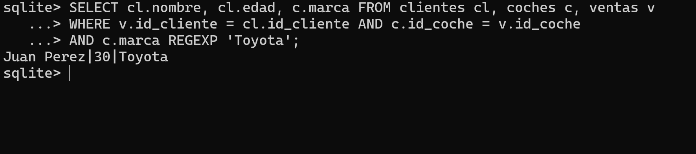
 
<br>

### __2.__ Consulta para calcular el precio promedio de los coches vendidos.


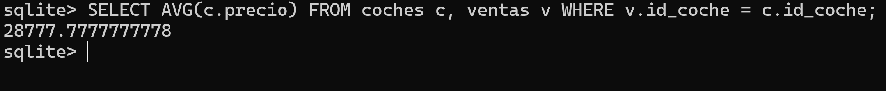


<br>

### __3.__ Consulta para obtener el modelo y la marca de los coches vendidos a clientes menores de 30 años.

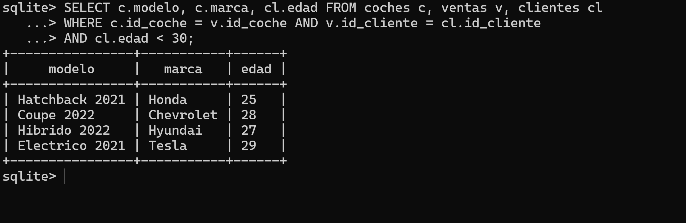

<br>

### __4.__ Consulta para contar el número de coches vendidos de cada marca.


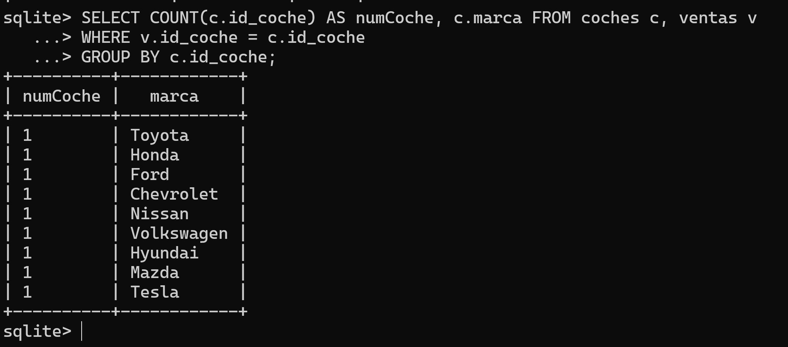


<br>

### __5.__ Consulta para obtener el nombre y la dirección de los clientes que han llevado a reparar sus coches en 2024.

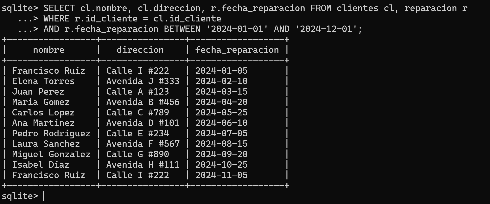

<br>

### __6.__ Consulta para calcular el total gastado en reparaciones por cada cliente.


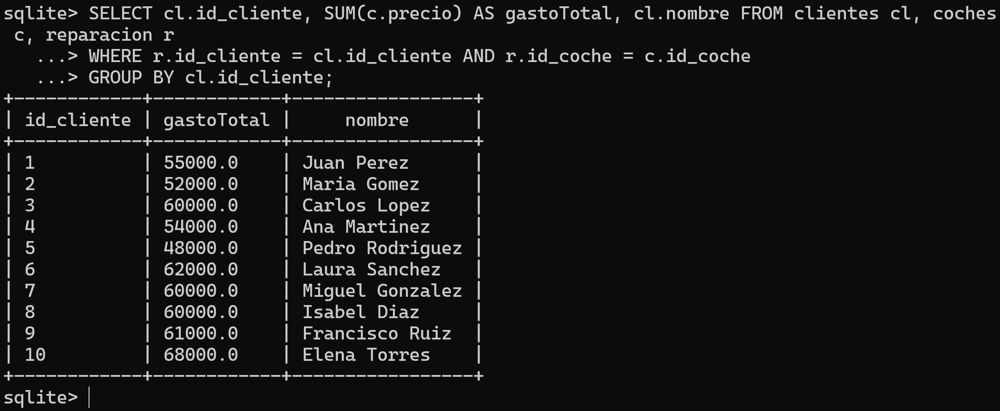
 
<br>

### __7.__ Consulta para obtener el nombre y la edad de los clientes que han comprado coches de más de 30000 euros.


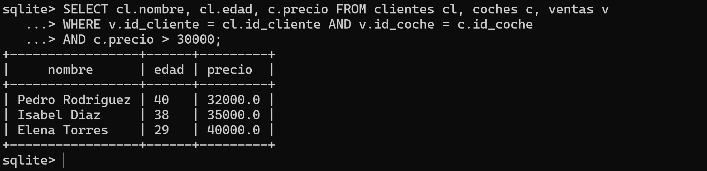


<br>

### __8.__ Consulta para calcular el precio medio de los coches vendidos en 2023.

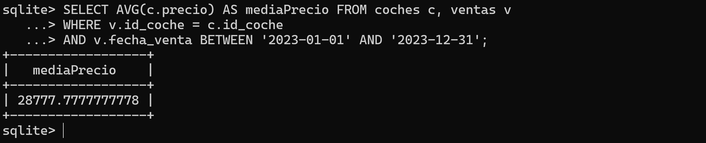

<br>

### __9.__ Consulta para obtener el nombre y la dirección de los clientes que han comprado coches de la marca Ford.


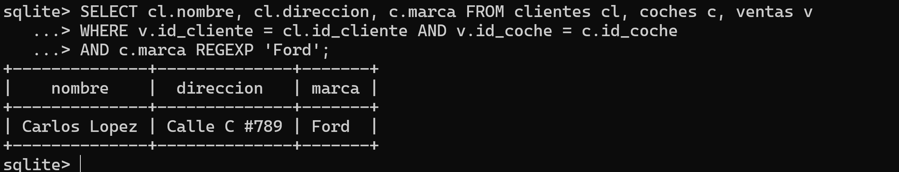


<br>

### __10.__ Consulta para contar el número de coches vendidos por año.

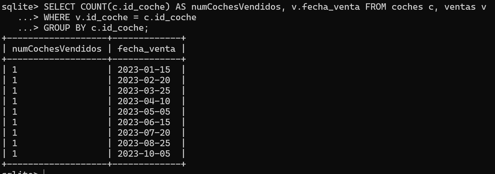

<br>

### __11.__ Consulta para obtener el nombre y la edad de los clientes que han comprado coches de más de 30000 euros y llevado a reparar sus coches.


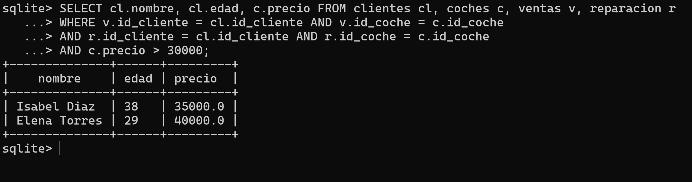
 
<br>

### __12.__ Consulta para calcular el precio total de los coches vendidos a clientes menores de 30 años.


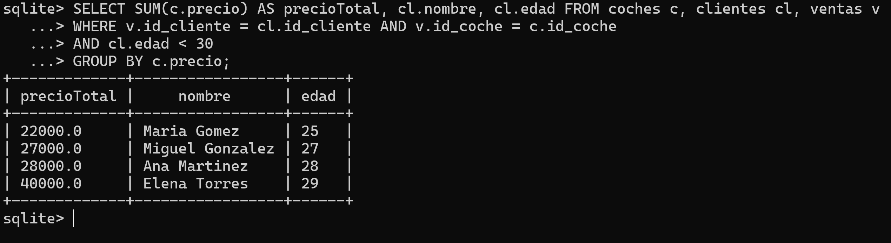


<br>

### __13.__ Consulta para obtener el modelo y el año de los coches vendidos en 2023 y llevados a reparar.

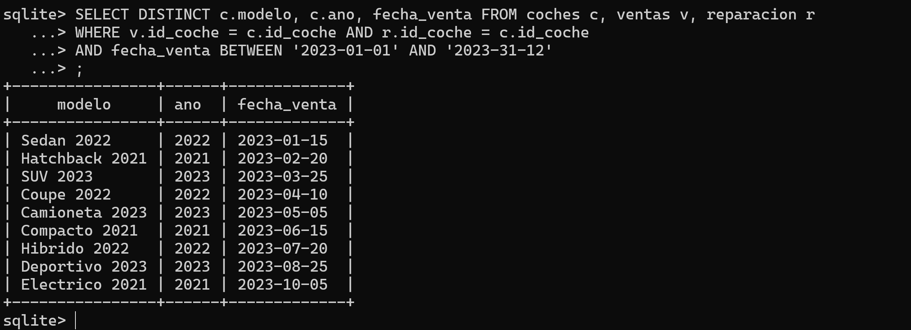

<br>

### __14.__ Consulta para contar el número de coches vendidos por cliente.


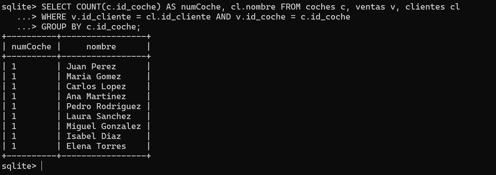


<br>

### __15.__ Consulta para obtener el nombre y el precio de los coches vendidos a clientes mayores de 35 años.

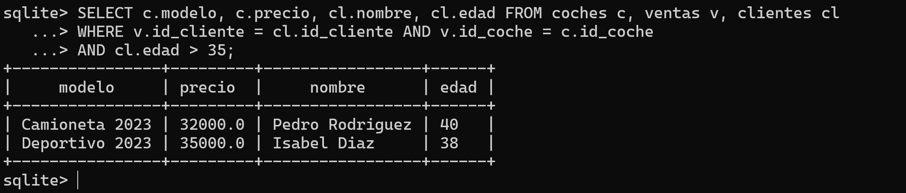

<br>

### __16.__ Consulta para calcular el precio total de los coches vendidos a clientes que viven en una calle (en la dirección).


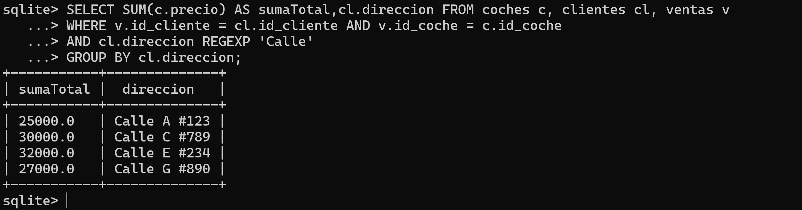
 
<br>

### __17.__ Consulta para obtener el nombre y la dirección de los clientes que han comprado coches de más de 30000 euros y llevado a reparar sus coches en 2024.


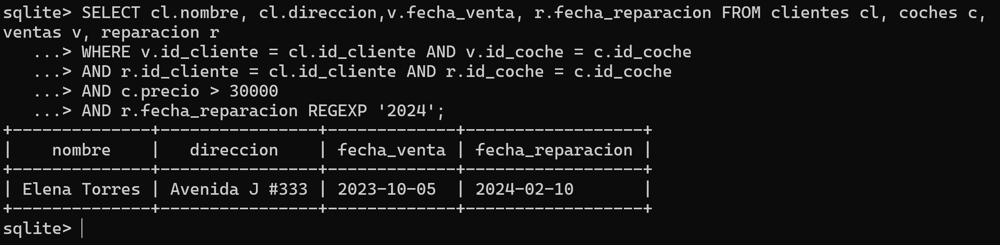


<br>

### __18.__ Consulta para calcular el precio medio de los coches vendidos en 2023 y llevados a reparar por clientes menores de 30 años.

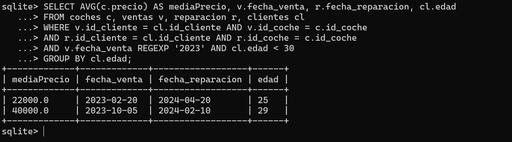

<br>

### __19.__ Consulta para obtener el modelo y el año de los coches vendidos por clientes que tienen una dirección que contiene la palabra "Avenida".


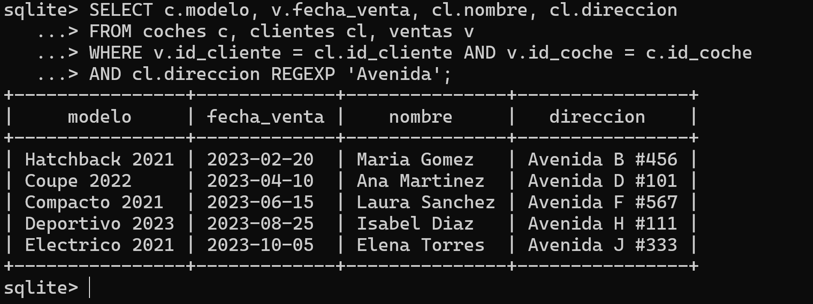


<br>

### __20.__ Consulta para contar el número de reparaciones realizadas en 2024 por cada cliente.

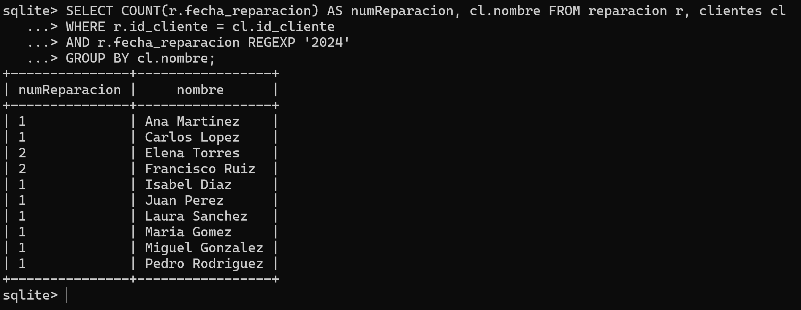


</div>