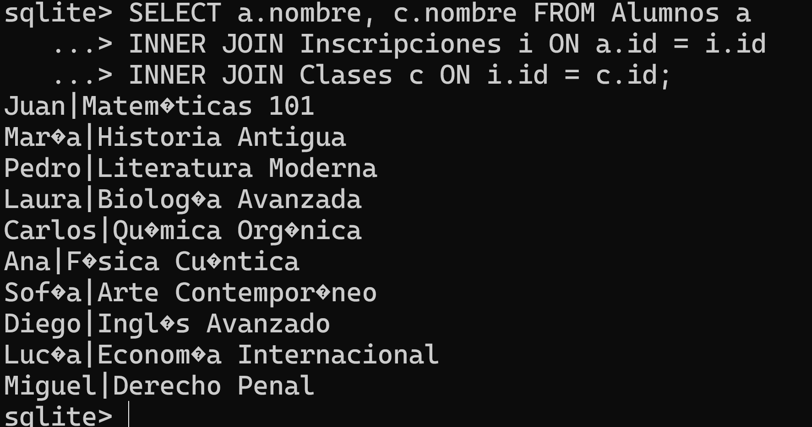
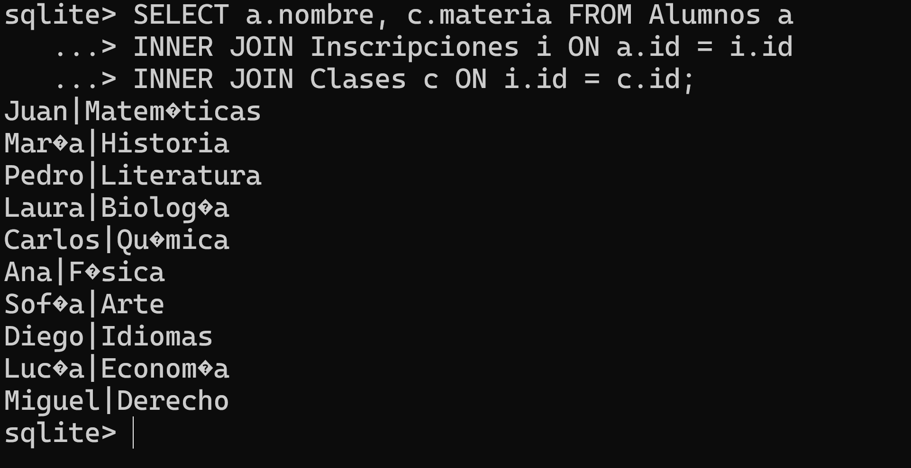
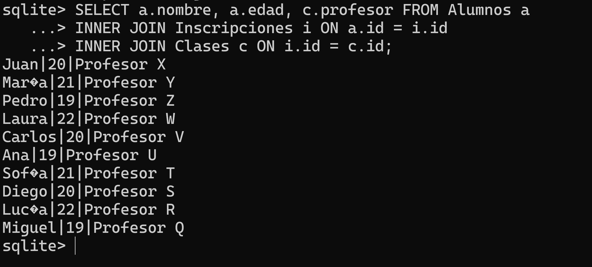
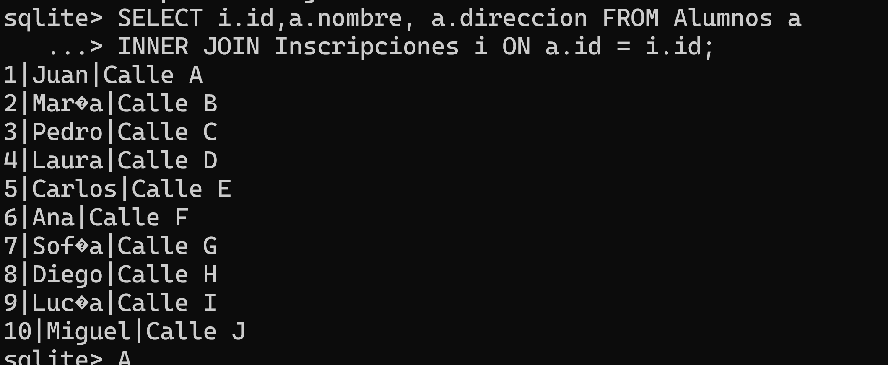
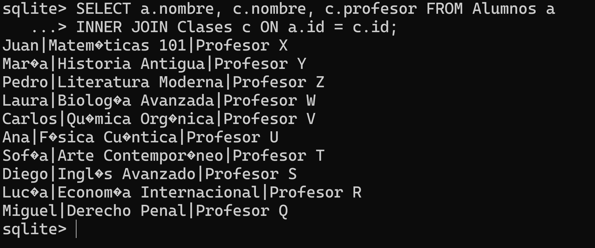
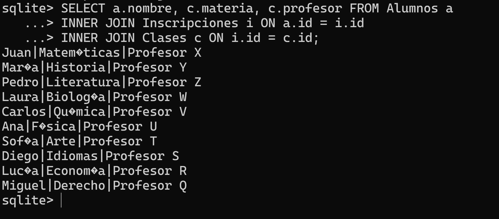
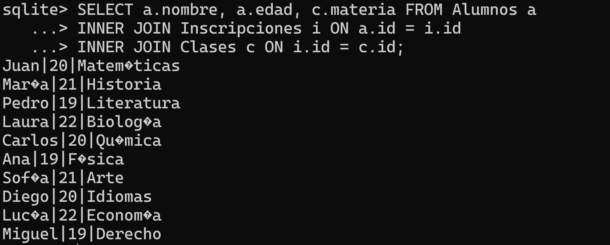
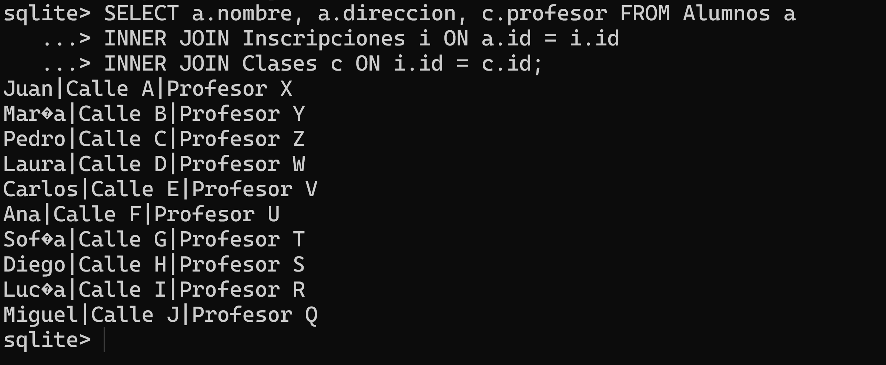
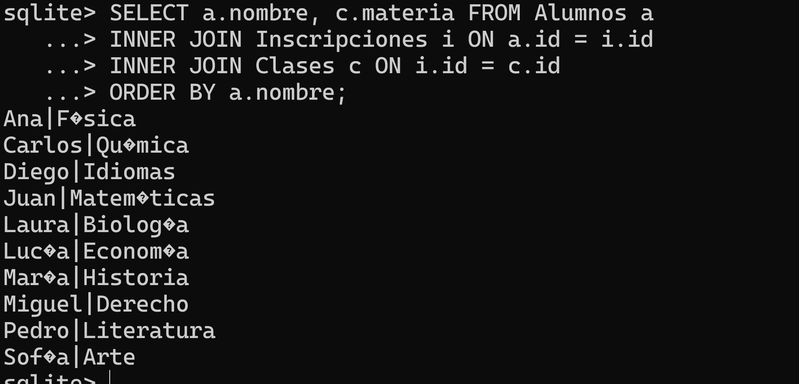
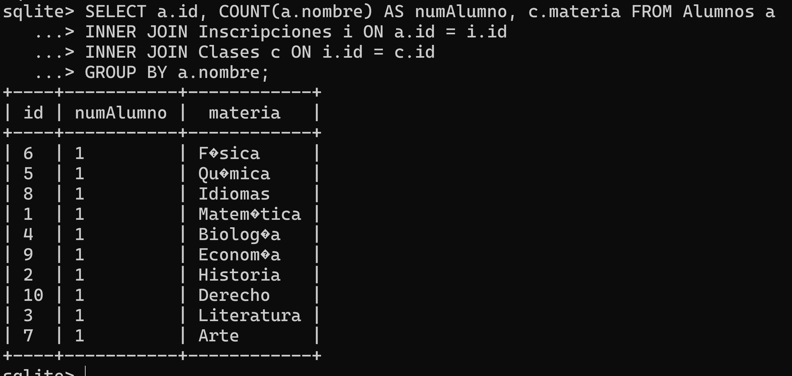

<div align="justify">


# UNIDAD 3 TAREA 9 (Trabajo con join y funciones matemáticas).

### 📜📜 TRABAJO CON JOIN Y FUNCIONES MATEMÁTICAS 📜📜


<br>

<details>

<summary><b>Base de datos<b/></summary>

```SQL
CREATE TABLE IF NOT EXISTS Alumnos (
    id INTEGER PRIMARY KEY,
    nombre TEXT,
    edad INTEGER,
    direccion TEXT
);

INSERT INTO Alumnos (nombre, edad, direccion) VALUES
    ('Juan', 20, 'Calle A'),
    ('María', 21, 'Calle B'),
    ('Pedro', 19, 'Calle C'),
    ('Laura', 22, 'Calle D'),
    ('Carlos', 20, 'Calle E'),
    ('Ana', 19, 'Calle F'),
    ('Sofía', 21, 'Calle G'),
    ('Diego', 20, 'Calle H'),
    ('Lucía', 22, 'Calle I'),
    ('Miguel', 19, 'Calle J');

-- Crear tabla para las clases
CREATE TABLE IF NOT EXISTS Clases (
    id INTEGER PRIMARY KEY,
    nombre TEXT,
    materia TEXT,
    profesor TEXT
);

INSERT INTO Clases (nombre, materia, profesor) VALUES
    ('Matemáticas 101', 'Matemáticas', 'Profesor X'),
    ('Historia Antigua', 'Historia', 'Profesor Y'),
    ('Literatura Moderna', 'Literatura', 'Profesor Z'),
    ('Biología Avanzada', 'Biología', 'Profesor W'),
    ('Química Orgánica', 'Química', 'Profesor V'),
    ('Física Cuántica', 'Física', 'Profesor U'),
    ('Arte Contemporáneo', 'Arte', 'Profesor T'),
    ('Inglés Avanzado', 'Idiomas', 'Profesor S'),
    ('Economía Internacional', 'Economía', 'Profesor R'),
    ('Derecho Penal', 'Derecho', 'Profesor Q');


CREATE TABLE IF NOT EXISTS Inscripciones (
    id INTEGER PRIMARY KEY,
    id_alumno INTEGER,
    id_clase INTEGER,
    FOREIGN KEY (id_alumno) REFERENCES Alumnos(id),
    FOREIGN KEY (id_clase) REFERENCES Clases(id)
);

INSERT INTO Inscripciones (id_alumno, id_clase) VALUES
    (1, 1), 
    (1, 2), 
    (2, 3), 
    (2, 4), 
    (3, 5), 
    (3, 6), 
    (4, 7), 
    (4, 8), 
    (5, 9), 
    (6, 10); 
```

</details>

<br>


## __CONSULTAS__


### __1.__ Obtener el nombre del alumno y el nombre de la clase en la que está inscrito.



 
<br>

### __2.__ Obtener el nombre del alumno y la materia de las clases en las que está inscrito.





<br>

### __3.__ Obtener el nombre del alumno, la edad y el nombre del profesor de las clases en las que está inscrito.



<br>

### __4.__ Obtener el nombre del alumno y la dirección de las clases en las que está inscrito.





<br>

### __5.__ Obtener el nombre del alumno y el nombre de la clase junto con el profesor.



<br>

### __6.__ Obtener el nombre del alumno, la materia y el nombre del profesor de las clases en las que está inscrito.



 
<br>

### __7.__ Obtener el nombre del alumno, la edad y la materia de las clases en las que está inscrito.





<br>

### __8.__ Obtener el nombre del alumno, la dirección y el profesor de las clases en las que está inscrito.



<br>

### __9.__ Obtener el nombre del alumno y la materia de las clases en las que está inscrito, ordenado por el nombre del alumno.





<br>

### __10.__ Contar cuántos alumnos están inscritos en cada clase.




</div>