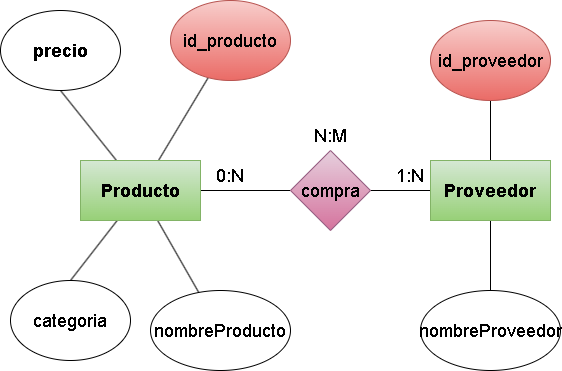
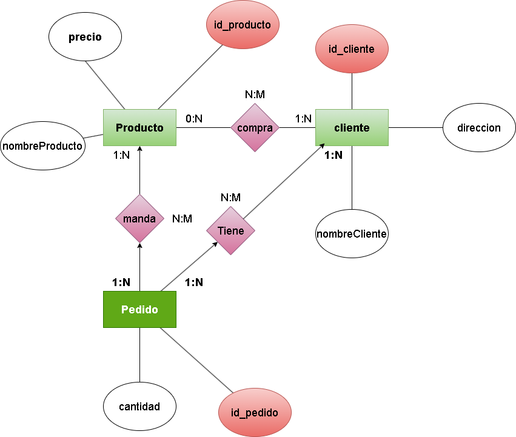

 
 

# **__Unidad 2/3 Tarea 6__** (Normalización)

## __Ejercicio 1: Lista de Productos__

### Tabla Inicial: Productos

| ID_Producto | Nombre_Producto | Proveedores | Categoría   | Precio |
| ----------- | ----------------| ------------| ------------| ------ |
| 1           | Laptop          | Dell, HP    | Tecnología  | 1000   |
| 2           | Mouse           | Logitech    | Accesorios  | 25     |

#### *__PROBLEMA:__* En la columna de los proveedores (Dell, HP) tiene valores multivaluados incumpliendo el 1FN

### Aplicamos 1FN para arreglarlo.

#### Nueva Tabla: Proveedores

| id_proveedor | nombreProveedor  |
| ------------ | ---------------- |
| 1            | Dell             |
| 2            | HP               |
| 3            | Logitech         |

## Ejercicio 2: Pedidos de Clientes

#### Tabla Inicial: Pedidos

| ID_Pedido | Cliente     | Dirección    | Producto | Cantidad | Precio |
| --------- | ----------- | ------------ | -------- | -------- | ------ |
| 101       | Juan Pérez  | Calle 123    | Laptop   | 1        | 1000   |
| 102       | Ana López   | Av. Central  | Teclado  | 2        | 50     |

#### *__PROBLEMA:__* (Dependencias funcionales) Los datos del cliente y del producto deben almacenarse por separado para evitar dependencias.

### Aplicamos 2FN

#### Tabla: Productos

| ID_Producto | nombreProducto  | Precio |
| ----------- | --------------- | ------ |
| 1           | Laptop          | 1000   |
| 2           | Teclado         | 50     |

#### Tabla: Cliente

| ID_Cliente | nombreCliente  | Dirección    |
| ---------- | -------------- | ------------ |
| 1          | Juan Pérez     | Calle 123    |
| 2          | Ana López      | Av. Central  |

#### Tabla: Pedido

| ID_Pedido | Cantidad |
| --------- | -------- |
| 101       | 1        |
| 102       | 2        |

### Ejercicio 3: Registro de Empleados

#### Tabla Inicial: Empleados
| ID_Empleado | Nombre    | Teléfonos      | Departamento |
| ----------- | --------- | -------------- | ------------ |
| 1           | Carlos R. | 12345, 67890   | Ventas       |
| 2           | Laura M.  | 54321          | Finanzas     |

#### *__PROBLEMA:__* En la columna de los *__Teléfonos__* tiene valores multivaluados incumpliendo el 1FN.

### Aplicando 1FN 

#### Tabla: Teléfono

| ID_Teléfono | ID_Empleado | Número |
| ----------- | ----------- | ------ |
| 1           | 1           | 12345  |
| 2           | 1           | 67890  |
| 3           | 2           | 54321  |

### Ejercicio 4: Reservas de Hotel

#### Tabla Inicial: Reservas

| ID_Reserva | Cliente   | Habitación | Fechas             | Precio |
| ---------- | --------- | ---------- | ------------------ | ------ |
| 5001       | Pedro G.  | 101        | 01/02,02/02,03/02  | 300    |
| 5002       | María T.  | 202        | 10/03,11/03        | 200    |

#### *__PROBLEMA:__* En la columna de las *__fechas__* tiene valores multivaluados incumpliendo el 1FN.

### Aplicando 1FN

##### Nueva Tabla: Fechas_Reservas

| ID_Reserva | Fecha  |
| ---------- | ------ |
| 5001       | 01/02  |
| 5001       | 02/02  |
| 5001       | 03/02  |
| 5002       | 10/03  |
| 5002       | 11/03  |

### Ejercicio 5: Inscripciones a Cursos

#### Tabla Inicial: Inscripciones

| ID_Inscripción | Estudiante | Curso       | Profesor    | Horarios                 |
| -------------- | ---------- | ----------- | ----------- | ------------------------ |
| 3001           | Luis R.    | Matemáticas | Prof. Pérez | Lunes 10AM,Miércoles 2PM |
| 3002           | Ana S.     | Física      | Prof. Gómez | Martes 3PM               |

#### *__PROBLEMA:__* En la columna de los *__horarios__* tiene valores multivaluados incumpliendo el 1FN.

### Aplicando 1FN

#### Tabla: Horarios

| ID_Horario | ID_Inscripción | Día        | Horarios |
| ---------- | -------------- | ---------- | -------- |
| 1          | 3001           | Lunes      | 10AM     |
| 2          | 3001           | Miércoles  | 2PM      |
| 3          | 3002           | Martes     | 3PM      |

### Ejercicio 6: Ventas de Tienda

### Tabla Inicial: Ventas
| ID_Venta | Cliente    | Productos Comprados | Total |
| -------- | ---------- | ------------------- | ----- |
| 8001     | Juan P.    | Celular,Funda       | 500   |
| 8002     | Andrea M.  | Laptop              | 1000  |

#### *__PROBLEMA:__* En la columna de los *__Productos Comprados__*  tiene valores multivaluados incumpliendo el 1FN.

### Aplicando 1FN

#### Tabla: Producto

| ID_Producto | Nombre_Producto | Precio |
| ----------- | --------------- | ------ |
| 1           | Celular         | 400    |
| 2           | Funda           | 100    |
| 3           | Laptop          | 1000   |

### Ejercicio 7: Biblioteca de Libros

#### Tabla Inicial: Libros

| ID_Libro | Título       | Autores    | Género          |
| -------- | ------------ | ---------- | --------------- |
| 101      | El Quijote   | Cervantes  | Novela          |
| 102      | 1984         | Orwell     | Ciencia Ficción |

#### *__PROBLEMA:__* En este caso particular en la columna *__autores__* no da problemas. Pero lo podrias dar a futuro en caso de que un libro tengo mas de un autor.

### Aplicando 1FN 

####  Tabla: Autores
| ID_Autor | Nombre_Autor |
| -------- | -------------|
| 1        | Cervantes    |
| 2        | Orwell       |

### Ejercicio 8: Facturación de Servicios

#### Tabla Inicial: Facturas

| ID_Factura | Cliente    | Servicios Contratados | Costo Total |
| ---------- | ---------- | --------------------- | ----------- |
| 9001       | Juan P.    | Internet,TV           | 50          |
| 9002       | Ana M.     | Teléfono              | 20          |

#### *__PROBLEMA:__* En la columna de los *__Servicios Contradados__* tiene valores multivaluados incumpliendo el 1FN.

#### Aplicando 1FN

#### Nueva Tabla: Servicios Contratados
| ID_Servicio | Nombre_Servicio | Costo |
| ----------- | --------------- | ----- |
| 1           | Internet        | 30    |
| 2           | TV              | 20    |
| 3           | Teléfono        | 20    |

### Ejercicio 9: Gestión de Vehículos

#### Tabla Inicial: Vehículos

| ID_Vehículo | Marca   | Modelos         | Año  |
| ----------- | ------- | --------------- | ---- |
| 5001        | Toyota  | Corolla,Yaris   | 2022 |
| 5002        | Honda   | Civic           | 2023 |

### *__PROBLEMA:__* En la columna de los *__Modelos__* tiene valores multivaluados incumpliendo el 1FN.

#### Aplicando 1FN 

##### Nueva Tabla: Modelos

| ID_Vehículo | ID_Modelo | Nombre_Modelo |
|-------------|-----------|---------------| 
| 5001        | 1         | Corolla       | 
| 5001        | 2         | Yaris         | 
| 5002        | 3         | Civic         |

### Ejercicio 10: Gestión de Proyectos

### Tabla Inicial: Proyectos
| ID_Proyecto | Nombre     | Miembros       | Presupuesto |
| ----------- | ---------- | -------------- | ----------- |
| 7001        | Web App    | Juan,Ana       | 5000        |
| 7002        | E-commerce | Pedro,María    | 10000       |

### *__PROBLEMA:__* En la columna de los *__Miembros__* tiene valores multivaluados incumpliendo el 1FN.

### Aplicando 1FN 

#### Nueva Tabla: Miembro
| ID_Proyecto | ID_Miembro | Nombre_Miembro | 
| ----------- | ---------- | -------------- |
| 7001        | 1          | Juan           |
| 7001        | 2          | Ana            |
| 7002        | 3          | Pedro          |
| 7002        | 4          | María          |

 
