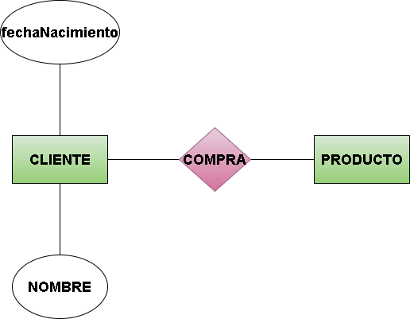
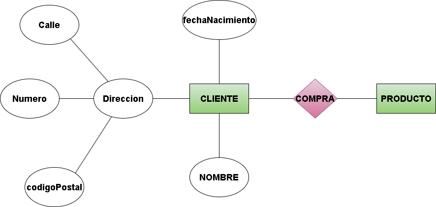
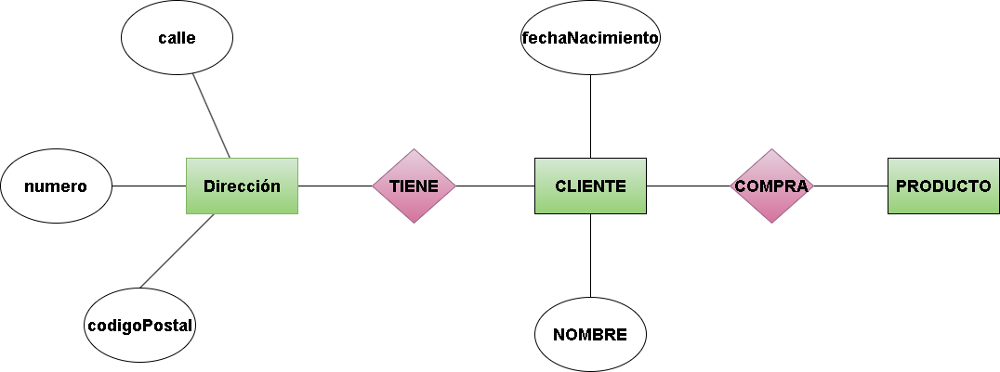
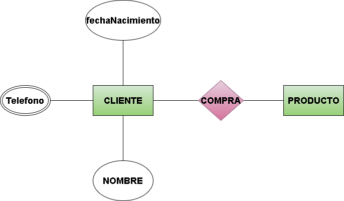
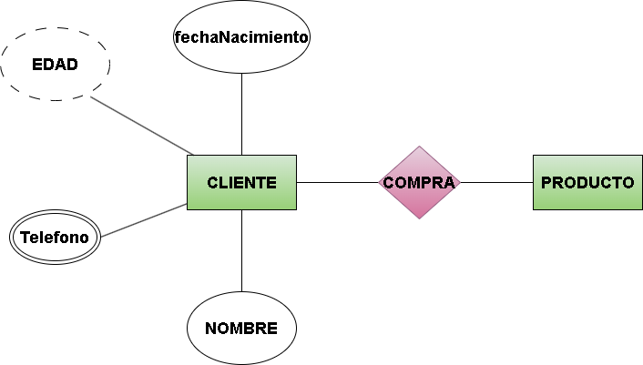
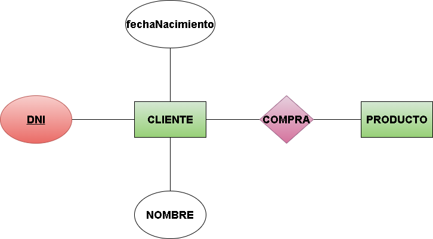
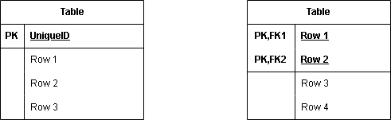
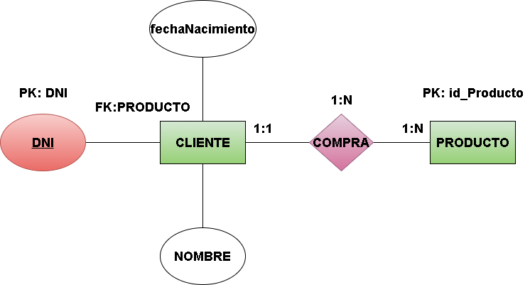
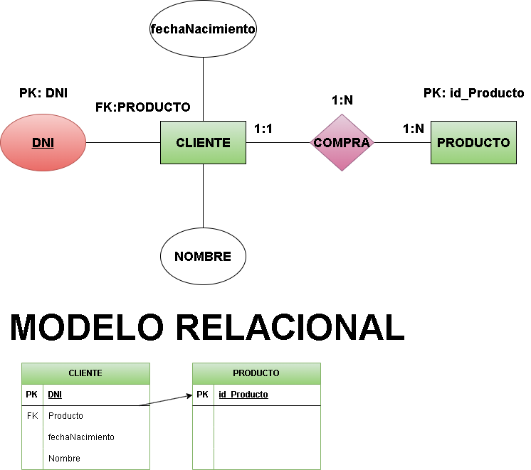
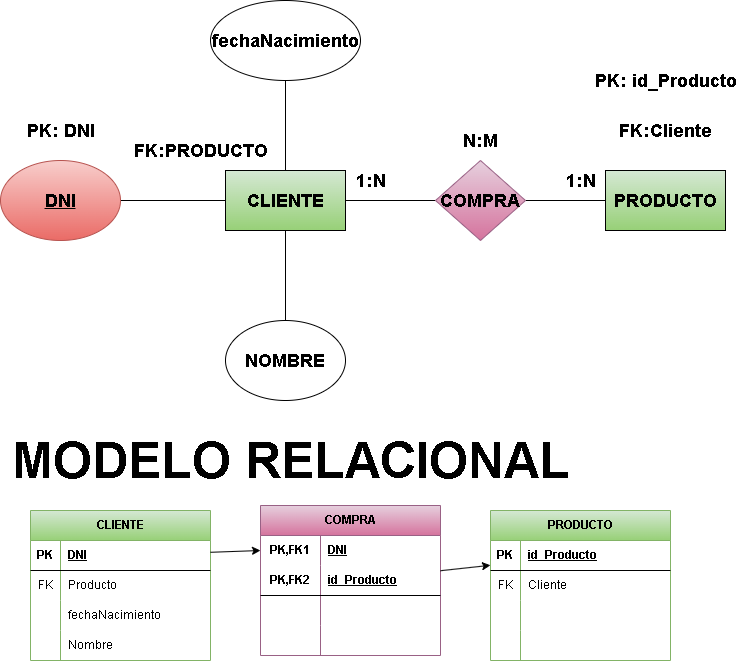

#  **__Repaso BASE DE DATOS PARA DIA 25 DE FEBRERO__**

##  ***__¿Que es base de datos__***

Una __base de datos__ es un sistema organizado para __almacenar, gestionar y acceder__ a información de manera eficiente. 💾

Por tanto, la regla más importante que tenemos siempre va ser

    

# No duplicar información

    

El tipo de bases de datos que vamos a ver es:

**__Bases de datos relacionales (SQL)__** – Organizan los datos en tablas con relaciones entre ellas (Ejemplo: **MySQL, PostgreSQL, SQL Server**).

    

## **__Entidades relacionales o E/R__**

Las **entidades relacionales** son tablas que representan objetos del mundo real en una base de datos relacional 💾.

El modelo que vamos a representar es el modelo **CHEN** que tienen las siguientes caracteristicas.

  

1. **Entidades 🟩 :** Las entidades por lo general se identifican por sus sustantivos (Persona, matricula etc...)
 
  

- **Fuertes (independientes):** Existen por sí mismas. **Ejemplo: Cliente, Producto.**

  

  

- **Débiles (dependientes):** Dependen de la otra entidad. Ejemplo: empleado tiene hijo. Pues hijo es una entidad débil ya que depende de empleado.

  

    

2. **Relación**  : Las relaciones se identifican por el verbo y como la propia palabra indica, tiene que tener relación con las **2 entidades**

### \- Ejemplo 1: COMPRA

### \- Ejemplo 2: Tiene

    

Este formato no siempre se cumple, debido a que existen relaciones **reflexivas o recursivas** ya que ocurren cuando una entidad está relacionada consigo misma.

    

### \- Ejemplo : Un cliente tiene un usuario.

    

Es importante que sea así, ya que de lo contrario al pasar de **Entidad Relación a Modelo Relacional** estariamos ***duplicando información*** incumpliendo la regla de oro de base de datos. Mas adelante explicaremos que es un Modelo Relacional.

    

3. **Atributos ⚪🔴 :** Un atributo es una característica o propiedad de una entidad en una base de datos.

  

\- **Atributo Simple o Atómico:** No se puede descomponer en otros atributos más pequeños.

    

### \- Ejemplo : cliente compra un producto. El cliente tiene como atributos, nombre , fecha de nacimiento

    

    

\- **Atributos compuestos:** Se puede dividir en subatributos.

    

### \- Ejemplo : Cliente compra un producto. El cliente tiene como atributos, **nombre , fecha de nacimiento y dirección**. Sabemos que el cliente vive en la **calle** la palma **número** 11 con un **código postal** 666

    

    

Como podemos ver un atributo puede tener subatributos. Pero esto no es la forma mas óptima de realizarlo. Si se trata de un atributo compuesto, podemos tomar como dirección como una entidad fuerte. Quedando de esta manera.

    

    

Esta es la forma mas idonea de realizar la E/R ya que, cuando queramos pasarlo al Modelo Relacional nos va resultar mucho mas sencillo.

    

\- **Atributo Multivaluado:** Puede tener más de un valor.

  

### \- Ejemplo : cliente compra un producto. El cliente tiene como atributos, nombre , fecha de nacimiento y varios números de telefonos.

    

    

Vemos que teléfono se representa con 2 círculo ya que teléfono tiene multiples valores como por ejemplo: 666, 420, 404.

    

\- **Atributo Derivado:** Su valor se obtiene a partir de otros atributos.

  

### \- Ejemplo : cliente compra un producto. El cliente tiene como atributos, nombre , fecha de nacimiento y varios números de telefonos. Ademas queremos saber la edad del cliente.

    

    

Vemos que **edad** está en lineas discontinuas, lo cual significa que edad va cambiando según con el tiempo. En este caso Particular la **edad** cambia cada año, por eso se pone con lineas discontinuas.

    

\- **Atributo Clave o Identificador:** Un atributo que permite identificar de manera única a una entidad.

    

### \- Ejemplo : cliente compra un producto. El cliente tiene como atributos, **nombre , fecha de nacimiento y DNI.**

    

    

El **atributo clave** lo idoneo seria destacarlo con un color y subrayarlo. Para identificar que es **atributo clave**

    

Antes de pasar que es una **Clave Primaria (Primary Key: PK) y Clave Foranea (Foreign key: FK)** debemos saber primero que son las cardinalidades.

    

 4. **Cardinalidad :** indica cuántas instancias de una entidad pueden estar relacionadas con una instancia de otra entidad.

     

 \- El 0 significa niguno

 \- El 1 significa uno

 \- La N o M significa muchos

### \- Ejemplo : cliente compra un producto.

    

    

Como vemos la cardinalidad funciona de esta manera. **Un cliente mínimo puede comprar un producto o máximo muchos productos** y si miramos desde el lado de los productos seria. **Mínimo un producto puede ser comprado por un cliente o máximo un único cliente.**

Pero no se cumple el 100% de los casos ya que el enunciado de una pregunta podria decir que **un producto es comprado por mucho clientes** por tanto, ya no seria la cardinalidad de cliente 1:1 puesto que es **1:N y la relación seria de muchos a muchos.**

Estas son todas las posibiliades posibles con las cardinalidades.

 

**1:1, 1:N, N:M, 0:N, 0:1**

 

El valor de la izquierda del punto es el valor mínimo y el valor de la derecha es el valor máximo.

Entonces para saber la cardinalidad de la relación entre 2 entidades es el valor máximo de ambas entidades. Aqui te muestro ejemplo como serian los resultados de las relaciones.

### caso 1:

entidad 1: 1:1 entidad 2: 1:1 ---> relación: 1:1

### caso 2:

entidad 1: 1:1 entidad 2: 1:N ---> relación: 1:N

### caso 3:

entidad 1: 1:N entidad 2: 1:N ---> relación: N:M (muchos a muchos)

### caso 4:

entidad 1: N:M entidad 2: 1:N ---> relación: N:M

### caso 5:

entidad 1: 1:1 entidad 2: N:M ---> relación: 1:N

  

Los 0 funciona igual que los 1, por lo que no hace falta estar poniendo también los 0. Por si acaso dejo un ejemplo de caso particular:

 

entidad 1: 0:N entidad 2: 0:N ---> relación: 0:N

 

Sabiendo como funciona las cardinalidades podemos ya pasar a como funciona la **Primary Key y la Foreign Key (PK, FK)**

  

La **Primary Key** funciona con el **atributo clave** y la **Foreign key** es la que hereda a la otra entidad lo identificamos con la cardinalidad N. Si ambas entidades tienen N ambas se heredan entre ellas.

    

### \- Ejemplo : cliente compra un producto. El cliente tiene como atributos, **nombre , fecha de nacimiento y DNI.**

    

    

Como podemos ver cada entidad tiene su **Primary Key** y la **Foreign Key** simplemente se hereda a la otra entidad. Sabiendo todo esto podemos pasar al **Modelo Relacional** para implementar estas llaves.

  

##  **__Modelo Relacional__**

El **Modelo Relacional** organiza los datos en tablas. Cada tabla tiene filas (registros) y columnas (atributos) y también propiedades. Las tablas se relacionan entre sí mediante claves Primarias y Foraneas.

 

Estos son los 2 tipos de tablas que nos podemos encontrar en el Modelo Relacional.

    

    

### \- Ejemplo : cliente compra un producto. El cliente tiene como atributos, **nombre , fecha de nacimiento y DNI.**

    

    

Primero tenemos que crear la  **Entidad Relación**, una vez creada si lo queremos pasar a Modelo Relacional seria de la siguiente manera.

    

    

En caso de que **un producto pueda ser comprado por muchos clientes** quedaria de la siguiente manera.

    

    

Como podemos apreciar se genera una tabla extra porque la relación entre 2 entidades es **N:M** por eso se genera una tabla más, además las relaciones tambien pueden tener atributos que se pone en la parte de las propiedades (Como en el caso de la entidad Cliente).

    

Y con todo esto no tenemos que saber más sobre los Modelos Relacionales solo queda practicar muchos ejercicios.

