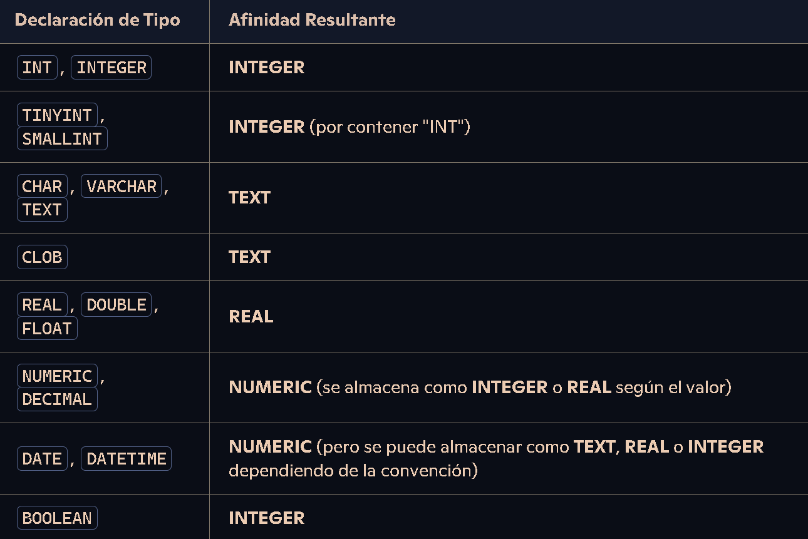

# __SUPER RESUMEN DE TODAS LAS CONSULTAS SQLITE3__

- <a href="#consultas-de-selección-y-cláusulas-básicas">Consultas de Selección y Cláusulas Básicas</a>

- <a href="#joins y subconsultas">JOINS Y SUBCONSULTAS</a>

- <a href="#expresiones-regulares-regexp">REGEXP (EXPRESIONES REGULARES)</a>


## CLAUSULAS


### 1. Sentencias de definición de datos

- __CREATE TABLE:__ Crea una nueva tabla 

- __DROP TABLE:__ Elimina una tabla y sus datos

- __CREATE INDEX:__ Crea un índice para optimizar consultas

- __DROP INDEX:__ Elimina un índice existente


### 2. Sentencias de Manipulación de Datos

- __INSERT INTO ... VALUES:__ Inserta nuevas filas en una  tabla


- __UPDATE ... SET ... WHERE:__ modifica los registros existentes


- __DELETE:__ Se utiliza para eliminar el registro


## __EJEMPLO__

```SQL
CREATE TABLE productos (
    id INTEGER PRIMARY KEY,
    nombre TEXT,
    categoria TEXT,
    precio REAL
);

CREATE TABLE ventas (
    id INTEGER PRIMARY KEY,
    id_producto INTEGER,
    cantidad INTEGER,
    fecha DATE,
    FOREIGN KEY (id_producto) REFERENCES productos(id)
);

INSERT INTO productos (id, nombre, categoria, precio) VALUES 
    (1, 'Arroz', 'Alimentos', 2.5),
    (2, 'Leche', 'Lácteos', 1.8),
    (3, 'Pan', 'Panadería', 1.2),
    (4, 'Manzanas', 'Frutas', 3.0),
    (5, 'Pollo', 'Carnes', 5.5),
    (6, 'Huevos', 'Lácteos', 1.0),
    (7, 'Yogurt', 'Lácteos', 2.0),
    (8, 'Tomates', 'Verduras', 2.2),
    (9, 'Queso', 'Lácteos', 4.0),
    (10, 'Cereal', 'Desayuno', 3.5),
    (11, 'Papel Higiénico', 'Hogar', 1.5),
    (12, 'Cepillo de Dientes', 'Higiene', 2.0),
    (13, 'Detergente', 'Limpieza', 2.8),
    (14, 'Galletas', 'Snacks', 1.7),
    (15, 'Aceite de Oliva', 'Cocina', 4.5),
    (16, 'Café', 'Bebidas', 5.0),
    (17, 'Sopa enlatada', 'Conservas', 2.3),
    (18, 'Jabón de Baño', 'Higiene', 1.2),
    (19, 'Botellas de Agua', 'Bebidas', 1.0),
    (20, 'Cerveza', 'Bebidas', 3.8);

INSERT INTO ventas (id_producto, cantidad, fecha) VALUES 
    (1, 5, '2024-01-17'),
    (2, 3, '2024-01-17'),
    (4, 2, '2024-01-17'),
    (5, 1, '2024-01-17'),
    (6, 10, '2024-01-18'),
    (8, 4, '2024-01-18'),
    (10, 2, '2024-01-18'),
    (14, 7, '2024-01-19'),
    (16, 3, '2024-01-19'),
    (18, 6, '2024-01-20');
 ```

 ## 🚀 EXPLICACION RAPIDA 🚀

 __ENTIDADES:__ PRODUCTOS, VENTAS

 __ATRIBUTOS:__ PRODUCTOS(id, nombre, categoria, precio) VENTAS(id_producto, cantidad, fecha)

 Los __ATRIBUTOS__ hay que asignarle el tipo de dato.

 __TEXT:__ cadena de texto (__STRING__)

 __REAL:__ numero __FLOTANTES__ (__FLOAT 8 BYTE__)

 __INTEGER:__ Números enteros (__INT__).

 > __Ahora vamos a nombrar los que faltan__
 
 

 

 ## Consultas de Selección y Cláusulas Básicas

 - __SELECT:__ Seleccion de atributo (__*__ == __TODOS LOS ATRIBUTOS__)

 - __FROM:__  Tabla en la que te encuentras

 - __WHERE:__ Condiciones que se tienen que cumplir para ejecutarse

 

 ### __FUNCIONES__

 

 ## EJEMPLO

 ```SQL
SELECT categoria, COUNT(*) AS total, AVG(precio) 

FROM productos;
```

- __GROUP BY:__ Agrupa los resultados según una o más columnas (COUNT, SUM ,AVG, MIN y MAX)

- __HAVING:__ grupos resultantes de la cláusula __GROUP BY__ (lo mismo que el __WHERE__ pero usamos __HAVING__ siempre despues del __GROUP BY__)

## EJEMPLO

```SQL
SELECT categoria, COUNT(*)
FROM productos
GROUP BY categoria
HAVING categoria > 10;
```

- __ORDER BY:__ Ordena las columas de forma ascendente (__ASC__) o decendentes (__DESC__)

- __LIMIT:__ Limita la cantidad de registros que va devolver

- __OFFSET:__ Omite un número de registros para poder comenzar a devolver las filas

### <div id="joins y subconsultas">3. 🚔🚔 __Joins y Subconsultas__ 🚔🚔</div> 

## JOINS


<br>

- __INNER JOIN:__ Tiene que coincidir en __ambas tablas__

- __LEFT JOIN:__ Devuelve la tabla de la izquierda y los coincidentes

- __RIGHT JOIN:__ Devuelve la tabla de la derecha y los coincidentes

## SUBCONSULTAS

subconsultas son __consultas dentro de otra consulta.__

```SQL
SELECT nombre, precio
FROM productos
WHERE categoria = (SELECT categoria FROM categorias WHERE nombre = 'Electrónica'); -- Soy SUBCONSULTA ()
```

### __EXPRESIONES REGULARES (REGEXP)__

Permite realizar comparaciones complejas (SIEMPRE HAY QUE USAR ESTE Y __NO__ LIKE)

## EJEMPLO

```SQL
SELECT * FROM registros WHERE dato REGEXP '^[A-Z]{3}[0-9]{4}$';
```

### __TODOS LOS OPERADORES CON REGEXP__


| Operador  | Descripción                                      | Ejemplo                |
|-----------|--------------------------------------------------|------------------------|
| `.`       | Coincide con cualquier carácter excepto nueva línea | `a.b` coincide con "aab", "abb", "acb", etc. |
| `^`       | Coincide con el inicio de la cadena               | `^abc` coincide con "abc" al inicio de la cadena. |
| `$`       | Coincide con el final de la cadena                | `xyz$` coincide con "xyz" al final de la cadena. |
| `*`       | Coincide con cero o más repeticiones del elemento anterior | `a*b` coincide con "ab", "aab", "aaab", etc. |
| `+`       | Coincide con una o más repeticiones del elemento anterior | `a+b` coincide con "ab", "aab", "aaab", etc. |
| `?`       | Coincide con cero o una repetición del elemento anterior | `a?b` coincide con "ab" o "b". |
| `\`       | Escapa el significado especial de un carácter      | `\.` coincide con el carácter punto literal. |
| `[]`      | Coincide con cualquier carácter dentro de los corchetes | `[aeiou]` coincide con cualquier vocal. |
| `[^]`     | Coincide con cualquier carácter que no esté dentro de los corchetes | `[^0-9]` coincide con cualquier carácter que no sea un dígito. |
| `()`      | Agrupa elementos para aplicar operadores a una expresión completa | `(abc)+` coincide con "abc", "abcabc", etc. |
| `\d`      | Coincide con un dígito (equivalente a `[0-9]`)   | `\d{3}` coincide con tres dígitos. |
| `\w`      | Coincide con un carácter de palabra (letras, dígitos, guiones bajos) | `\w+` coincide con una o más palabras. |
| `\s`      | Coincide con un carácter de espacio en blanco     | `\s*` coincide con cero o más espacios en blanco. |
| `|`       | Operador lógico "o"                               | `a|b` coincide con "a" o "b". |


## Continuará


 
