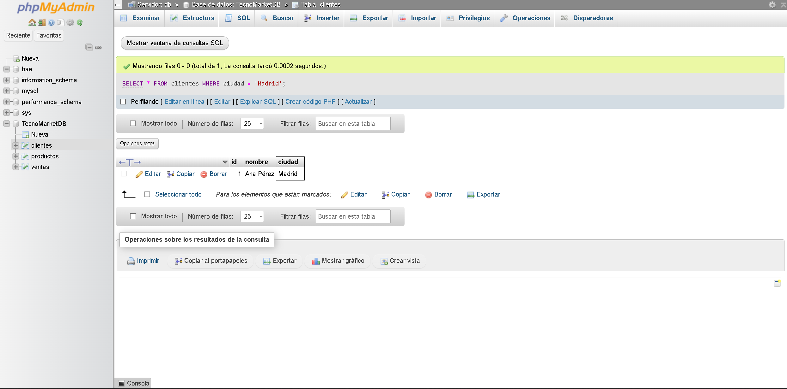
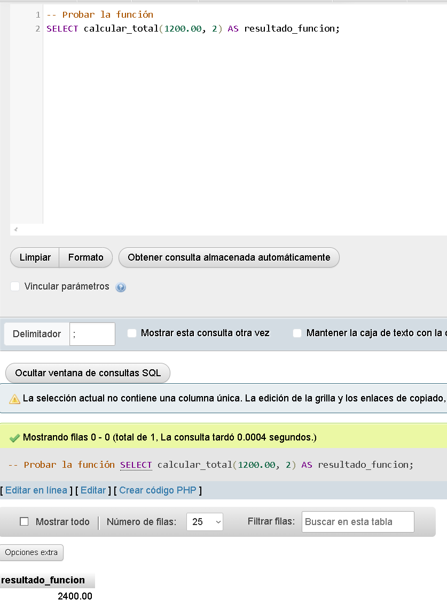
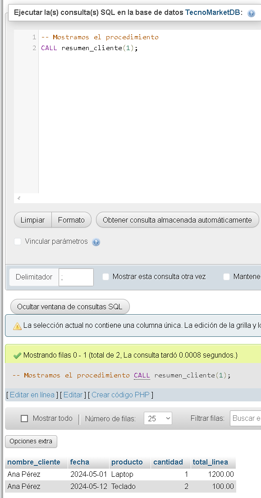
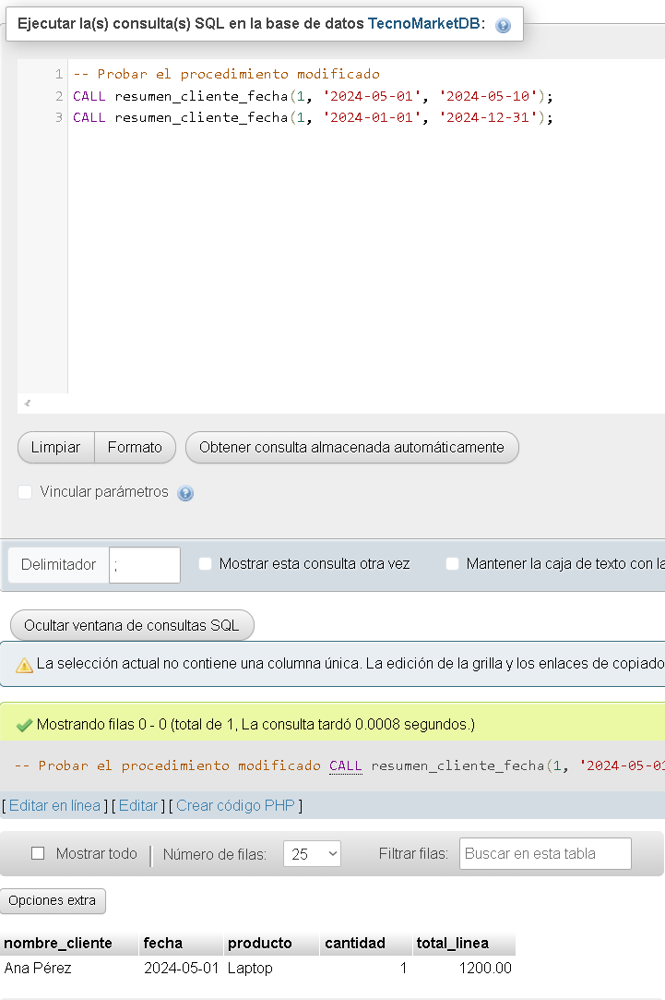
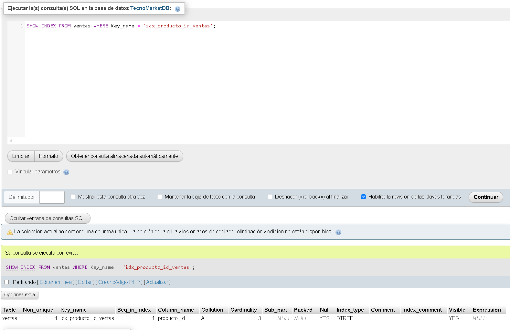
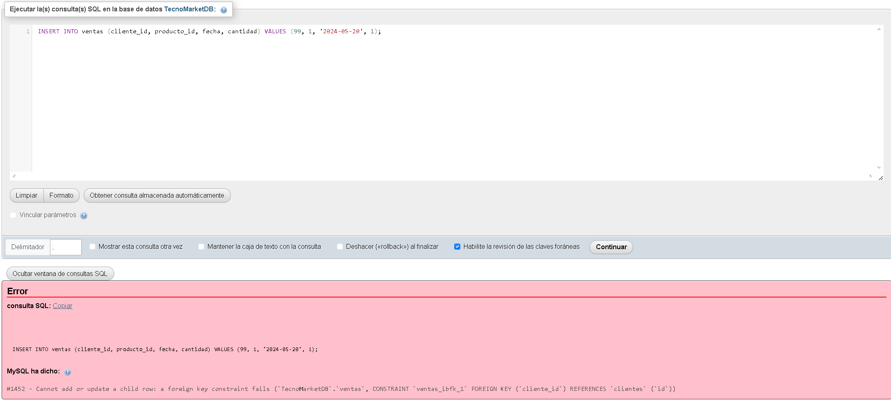
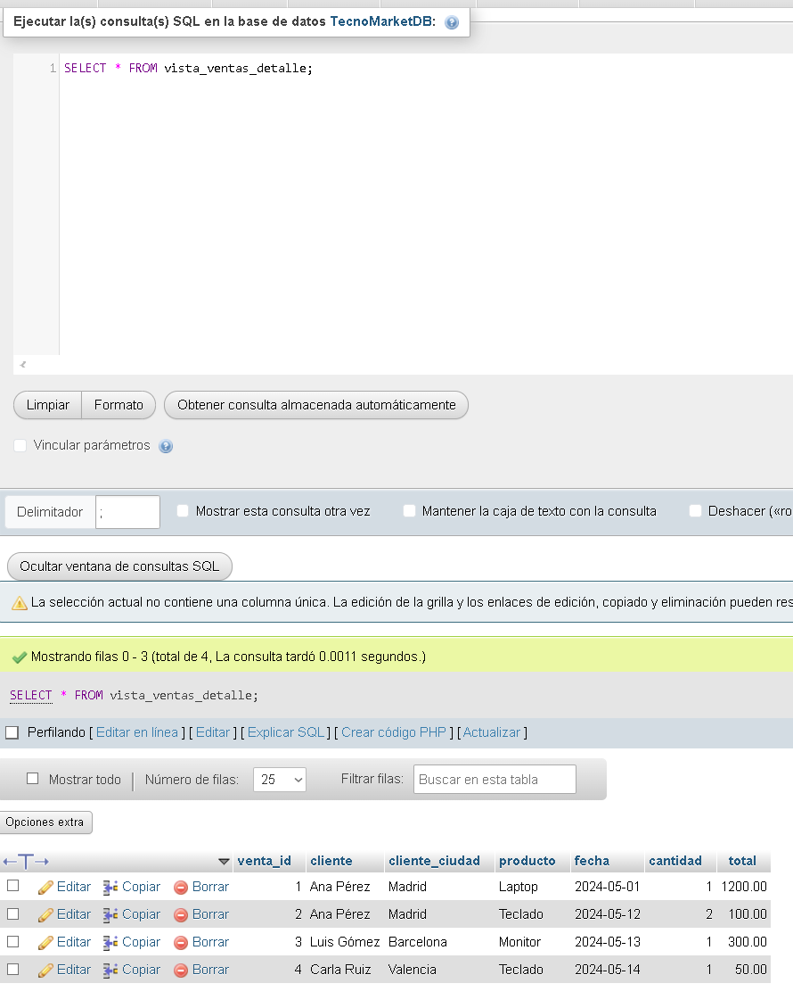
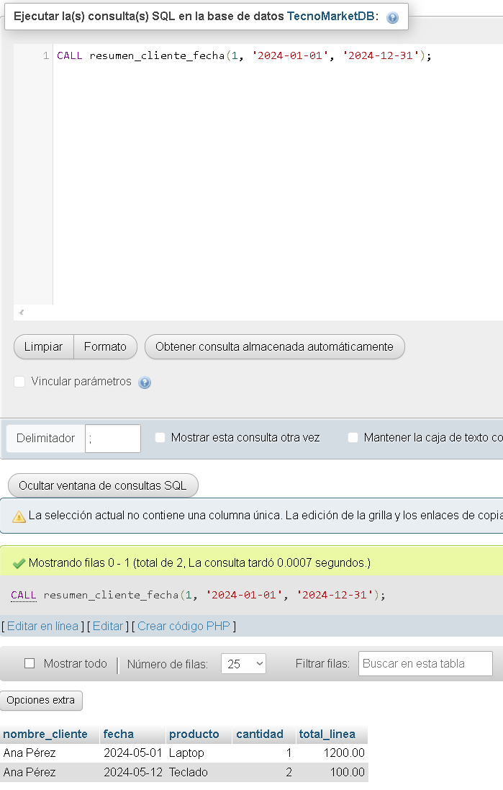
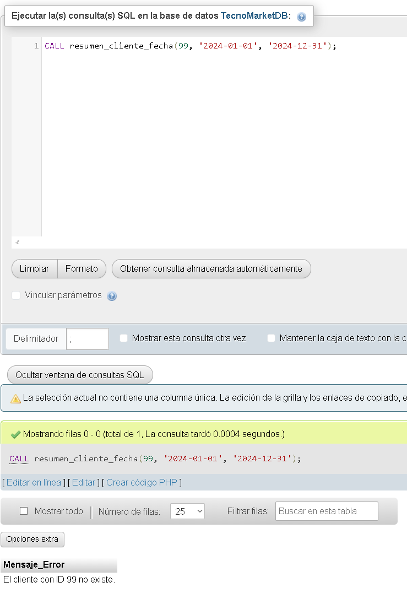

<div align="justify">

# Simulacro de bbdd 🧪: Índices, Vistas, Funciones y Procedimientos


### 📘 Parte 1: Creación de tablas


<details>

<summary>Creacion de tablas</summary>

```sql
CREATE TABLE clientes (
    id INT AUTO_INCREMENT PRIMARY KEY,
    nombre VARCHAR(100),
    ciudad VARCHAR(50)
);

CREATE TABLE productos (
    id INT AUTO_INCREMENT PRIMARY KEY,
    nombre VARCHAR(100),
    precio DECIMAL(10, 2)
);

CREATE TABLE ventas (
    id INT AUTO_INCREMENT PRIMARY KEY,
    cliente_id INT,
    producto_id INT,
    fecha DATE,
    cantidad INT,
    FOREIGN KEY (cliente_id) REFERENCES clientes(id),
    FOREIGN KEY (producto_id) REFERENCES productos(id)
);
INSERT INTO productos (id, nombre, precio) VALUES
(1, 'Laptop', 1200.00),
(2, 'Teclado', 50.00),
(3, 'Monitor', 300.00);

INSERT INTO ventas (id, cliente_id, producto_id, fecha, cantidad) VALUES
(1, 1, 1, '2024-05-01', 1),
(2, 1, 2, '2024-05-12', 2),
(3, 2, 3, '2024-05-13', 1),
(4, 3, 2, '2024-05-14', 1);
```

</details>


### 🔍 Parte 2: Creación de índices

```SQL
-- Crear índice en clientes(ciudad)
CREATE INDEX idx_ciudad ON clientes(ciudad);

-- Crear índice en ventas(fecha)
CREATE INDEX idx_fecha ON ventas(fecha);
```

### Comprobamos que los indices existen

```SQL
SHOW INDEX FROM clientes;
SHOW INDEX FROM ventas;
```

### Comprobamos el rendimiento




### ¿Son óptimos?

#### Los índices hacen que las búsquedas (SELECT) sean mucho más rápidas.


### 👁️ Parte 3: Crear una vista

```SQL
CREATE VIEW vista_ventas_detalle AS

SELECT v.id AS venta_id,c.nombre AS cliente,p.nombre AS producto,v.fecha,v.cantidad,(p.precio * v.cantidad) AS total
    
FROM ventas v

JOIN clientes c ON v.cliente_id = c.id

JOIN productos p ON v.producto_id = p.id;
```

### Verificamos de que existe la vista

```SQL
-- Consultar la vista
SELECT * FROM vista_ventas_detalle;
```

### Resultado esperado:


<br>

### 🧮 Parte 4: Crear una función

```SQL
DELIMITER //

CREATE FUNCTION calcular_total(
precio DECIMAL(10, 2),cantidad INT
)
RETURNS DECIMAL(10, 2)
DETERMINISTIC

BEGIN

RETURN precio * cantidad;

END //
```

### Verificamos que funciona




### ⚙️ Parte 5: Crear un procedimiento

#### Creamos un procedimiento resumen_cliente

```SQL
DELIMITER //

CREATE PROCEDURE resumen_cliente(
    IN p_cliente_id INT
)
BEGIN

SELECT c.nombre AS nombre_cliente, v.fecha, p.nombre AS producto, v.cantidad, calcular_total(p.precio, v.cantidad) AS total_linea -- Usando la función
        
FROM ventas v

JOIN

clientes c ON v.cliente_id = c.id

JOIN

productos p ON v.producto_id = p.id

WHERE

v.cliente_id = p_cliente_id;

END //

DELIMITER ;
```

### Resultado esperado.




### ❓ Preguntas teóricas

#### 1. ¿Qué ventajas ofrece el uso de una vista en lugar de una consulta con múltiples JOIN?

Evitar errores debido a escribir JOIN de forma diferente, además de hacerlo mas simple y poder reutilizarlo.

#### 2. ¿Por qué es importante declarar una función como DETERMINISTIC?

La función siempre dará el __mismo resultado__ para las mismas entradas, optimizando mejor, como guardando el resultado para no recalcularlo.     

#### 3. ¿Cuál es la diferencia entre una función y un procedimiento?

- Una función siempre devuelve un solo valor (ej. un número, un texto) y se usa dentro de otras consultas SQL.

- Un procedimiento realiza una tarea o un conjunto de acciones, y puede devolver un conjunto de resultados (como una tabla) o ninguno.

#### 4. ¿Qué impacto tienen los índices sobre el rendimiento de una base de datos?

Los índices hacen que las búsquedas (SELECT) sean mucho más rápidas.

#### 5. ¿Cuándo se recomienda usar un trigger en lugar de un procedimiento?

Usa un __trigger__ cuando necesites que una acción se ejecute automáticamente después de un __INSERT, UPDATE o DELETE__ en una tabla como por ejemplo para registrar un cambio.


Usa un __procedimiento__ cuando quieras ejecutar un conjunto de acciones cuando tú lo decidas llamándolo explícitamente.

📝 Preguntas prácticas

#### 1. Modifica el procedimiento para filtrar también por un rango de fechas.

```SQL
DROP PROCEDURE IF EXISTS resumen_cliente; -- Elimina el anterior para recrearlo
```

<br>

```SQl
DELIMITER //
CREATE PROCEDURE resumen_cliente_fecha(
    IN p_cliente_id INT,
    IN p_fecha_inicio DATE,
    IN p_fecha_fin DATE
)
BEGIN
    SELECT c.nombre AS nombre_cliente, v.fecha, p.nombre AS producto, v.cantidad, calcular_total(p.precio, v.cantidad) AS total_linea

    FROM ventas v

    JOIN clientes c ON v.cliente_id = c.id

    JOIN productos p ON v.producto_id = p.id

    WHERE v.cliente_id = p_cliente_id AND v.fecha BETWEEN p_fecha_inicio AND p_fecha_fin;
END //
DELIMITER ;
```

### Verificamos el procedimiento modificado



#### 2. Crea un índice sobre la columna producto_id en la tabla ventas.

```SQL
CREATE INDEX idx_producto_id_ventas ON ventas(producto_id);
```

### Verificamos que se ha creado el índice



#### 3. ¿Qué ocurre si insertas una venta con un cliente_id inexistente?

Esto es lo que ocurre cuando intentas insertarlo



Se debe a que la columna __ventas.cliente_id__ está definida como una clave foránea que referencia a __clientes.id.__

#### 4. Modifica la vista para incluir también el nombre de la ciudad del cliente.

```SQL
-- Usamos CREATE OR REPLACE VIEW para modificarla si ya existe
CREATE OR REPLACE VIEW vista_ventas_detalle AS

SELECT v.id AS venta_id, c.nombre AS cliente,

c.ciudad AS cliente_ciudad, -- Columna añadida

p.nombre AS producto, v.fecha, v.cantidad, (p.precio * v.cantidad) AS total
FROM ventas v

JOIN clientes c ON v.cliente_id = c.id
JOIN productos p ON v.producto_id = p.id;
```

### Verificar que funciona



#### 5. Agrega una validación en el procedimiento para evitar resultados si el cliente no existe.

```SQL
-- Eliminar para recrear
DROP PROCEDURE IF EXISTS resumen_cliente_fecha; 
```

```SQL
DELIMITER //
CREATE PROCEDURE resumen_cliente_fecha(
    IN p_cliente_id INT,
    IN p_fecha_inicio DATE,
    IN p_fecha_fin DATE
)
BEGIN
DECLARE v_cliente_existe INT DEFAULT 0;

    -- Verificar si el cliente existe
    SELECT COUNT(*) INTO v_cliente_existe FROM clientes WHERE id = p_cliente_id;

    IF v_cliente_existe = 0 THEN
        SELECT CONCAT('El cliente con ID ', p_cliente_id, ' no existe.') AS Mensaje_Error;
    ELSE
        -- El cliente existe, proceder con la consulta de ventas
        SELECT c.nombre AS nombre_cliente, v.fecha, p.nombre AS producto, v.cantidad, calcular_total(p.precio, v.cantidad) AS total_linea
        FROM ventas v
        JOIN clientes c ON v.cliente_id = c.id
        JOIN productos p ON v.producto_id = p.id
        WHERE v.cliente_id = p_cliente_id AND v.fecha BETWEEN p_fecha_inicio AND p_fecha_fin;

    END IF;

END //
DELIMITER ;
```

### Verificar que funciona

#### __Cliente existente__



#### __Cliente que no existe__



</div>